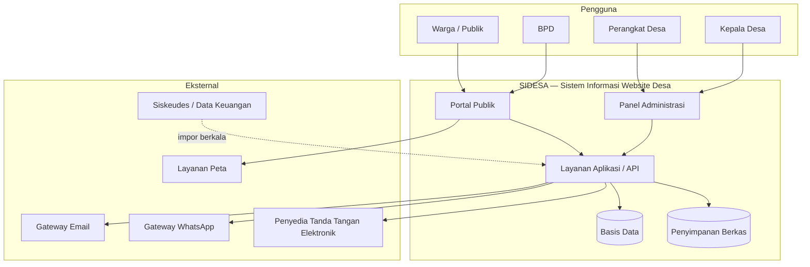
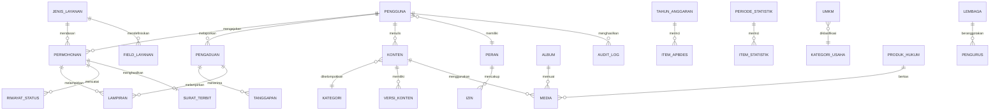
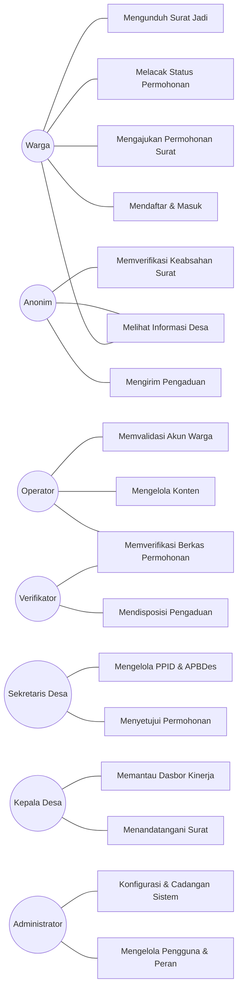
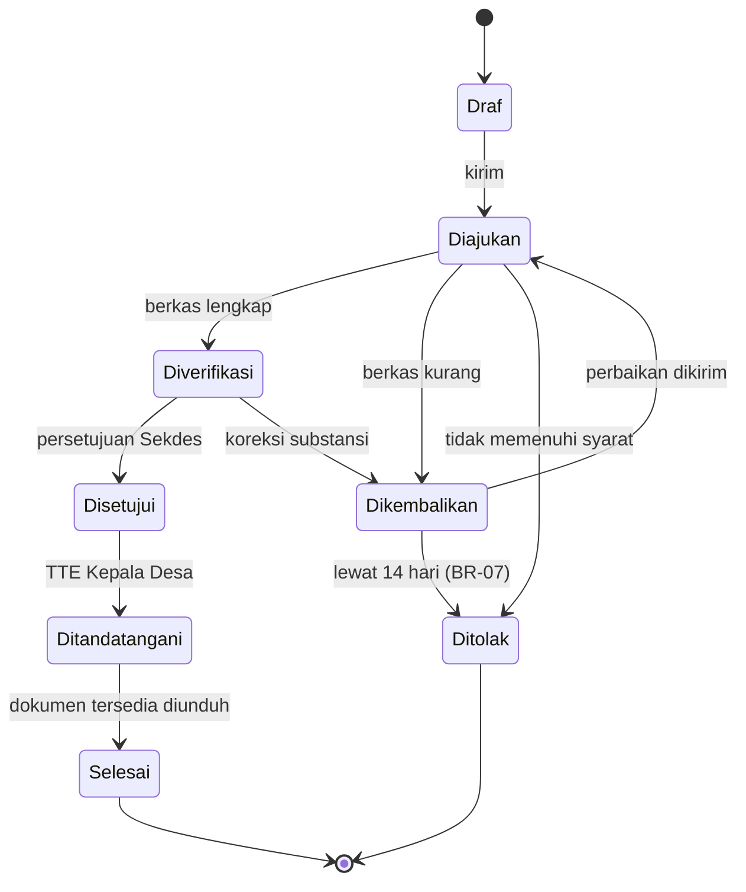
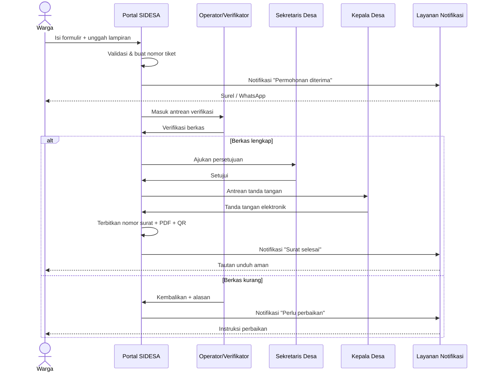
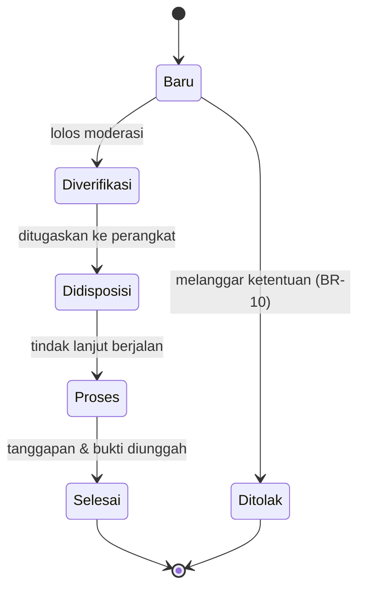

# Software Requirements Specification (SRS)
## Sistem Informasi Website Desa

| | |
|---|---|
| **Nama Dokumen** | Software Requirements Specification (SRS) — Sistem Informasi Website Desa |
| **Kode Dokumen** | SRS-WDESA-001 |
| **Versi** | 1.0 |
| **Status** | Draft untuk Review |
| **Tanggal Terbit** | 29 September 2026 |
| **Klasifikasi** | Internal / Terbatas |
| **Standar Acuan** | ISO/IEC/IEEE 29148:2018, IEEE Std 830-1998, ISO/IEC 25010:2011 |
| **Disusun oleh** | Tim Manajemen Proyek |
| **Pemilik Produk** | Pemerintah Desa (Sekretaris Desa / Kasi Pemerintahan) |

### Riwayat Revisi

| Versi | Tanggal | Penulis | Ringkasan Perubahan |
|---|---|---|---|
| 0.1 | 15 Sep 2026 | Tim Analis | Kerangka awal, hasil wawancara pemangku kepentingan |
| 0.5 | 22 Sep 2026 | Tim Analis | Penambahan kebutuhan fungsional modul layanan surat |
| 1.0 | 29 Sep 2026 | Tim Manajemen Proyek | Dokumen lengkap untuk review dan persetujuan |

### Lembar Persetujuan

| Peran | Nama | Tanda Tangan | Tanggal |
|---|---|---|---|
| Kepala Desa (Sponsor) | _______________ | _______________ | ____ |
| Sekretaris Desa (Product Owner) | _______________ | _______________ | ____ |
| Ketua BPD (Perwakilan Masyarakat) | _______________ | _______________ | ____ |
| Project Manager (Pelaksana) | _______________ | _______________ | ____ |
| Technical Lead | _______________ | _______________ | ____ |

---

## Daftar Isi

1. [Pendahuluan](#1-pendahuluan)
2. [Deskripsi Umum Sistem](#2-deskripsi-umum-sistem)
3. [Kebutuhan Fungsional](#3-kebutuhan-fungsional)
4. [Kebutuhan Antarmuka Eksternal](#4-kebutuhan-antarmuka-eksternal)
5. [Kebutuhan Non-Fungsional](#5-kebutuhan-non-fungsional)
6. [Model Data](#6-model-data)
7. [Aturan Bisnis](#7-aturan-bisnis)
8. [Use Case dan Alur Proses](#8-use-case-dan-alur-proses)
9. [Matriks Ketertelusuran Kebutuhan](#9-matriks-ketertelusuran-kebutuhan)
10. [Strategi Pengujian dan Kriteria Penerimaan](#10-strategi-pengujian-dan-kriteria-penerimaan)
11. [Rencana Rilis dan Prioritas](#11-rencana-rilis-dan-prioritas)
12. [Analisis Risiko](#12-analisis-risiko)
13. [Lampiran](#13-lampiran)

---

## 1. Pendahuluan

### 1.1 Tujuan Dokumen

Dokumen ini mendefinisikan secara lengkap dan tidak ambigu seluruh kebutuhan perangkat lunak untuk **Sistem Informasi Website Desa** — sebuah platform digital yang menjadi kanal resmi informasi, transparansi anggaran, dan layanan administrasi Pemerintah Desa kepada masyarakat.

Dokumen ini ditujukan untuk:

| Pembaca | Bagian yang Relevan |
|---|---|
| Kepala Desa & Perangkat Desa (sponsor, pengguna) | Bab 1, 2, 3, 11 |
| BPD & perwakilan masyarakat | Bab 1, 2, 3, 12 |
| Project Manager | Seluruh dokumen |
| Arsitek & Pengembang | Bab 3, 4, 5, 6, 7, 8 |
| QA / Penguji | Bab 3, 5, 9, 10 |
| Tim Operasional & Pemeliharaan | Bab 4, 5, 13 |
| Auditor / Inspektorat | Bab 5.6, 7, 9 |

Dokumen ini menjadi **dasar kontrak kerja** antara Pemerintah Desa sebagai pemilik sistem dan tim pelaksana pengembangan, serta menjadi acuan tunggal (*single source of truth*) untuk pengujian penerimaan (UAT).

### 1.2 Ruang Lingkup Produk

**Nama Produk:** SIDESA — Sistem Informasi Desa Terpadu (Website Desa)

**Yang Termasuk dalam Lingkup (In Scope):**

1. Portal publik berisi profil desa, berita, pengumuman, agenda, galeri, dan potensi desa.
2. Publikasi transparansi anggaran (APBDes) dalam bentuk infografis dan dokumen unduhan.
3. Layanan administrasi surat-menyurat daring (pengajuan, verifikasi, penerbitan, unduh).
4. Kanal pengaduan dan aspirasi masyarakat beserta pelacakan status.
5. Portal PPID / keterbukaan informasi publik dan repositori produk hukum desa.
6. Direktori lembaga desa, perangkat desa, BUMDes, dan UMKM.
7. Panel administrasi berbasis peran (RBAC) untuk pengelolaan konten, layanan, dan pengguna.
8. Statistik desa agregat (demografi, pendidikan, pekerjaan) dalam bentuk visualisasi.
9. Integrasi notifikasi (email dan WhatsApp), peta lokasi, dan tanda tangan elektronik.

**Yang Tidak Termasuk dalam Lingkup (Out of Scope):**

| Kode | Item di Luar Lingkup | Keterangan |
|---|---|---|
| OOS-01 | Sistem keuangan desa (Siskeudes) | Website hanya mempublikasikan ringkasan, tidak melakukan pembukuan |
| OOS-02 | Sistem administrasi kependudukan inti (SIAK/Dukcapil) | Website tidak menjadi *master* data penduduk |
| OOS-03 | Transaksi pembayaran daring (payment gateway) | Layanan desa bersifat gratis; retribusi ditangani luring |
| OOS-04 | Aplikasi mobile native (Android/iOS) | Fase 1 menggunakan pendekatan *responsive web* / PWA |
| OOS-05 | Pengadaan perangkat keras & jaringan internet desa | Ditangani terpisah oleh anggaran infrastruktur |
| OOS-06 | Migrasi data historis lebih dari 5 tahun | Hanya data 5 tahun terakhir yang dimigrasi |

**Manfaat dan Sasaran Bisnis:**

| Kode | Sasaran | Indikator Keberhasilan (KPI) | Target 12 Bulan |
|---|---|---|---|
| OBJ-01 | Meningkatkan transparansi tata kelola desa | Dokumen APBDes & LPJ terpublikasi tepat waktu | 100% per periode |
| OBJ-02 | Mempersingkat waktu layanan administrasi | Rata-rata waktu proses surat | ≤ 1 hari kerja (dari 3 hari) |
| OBJ-03 | Menurunkan kunjungan fisik ke kantor desa | Persentase pengajuan surat via daring | ≥ 40% |
| OBJ-04 | Meningkatkan partisipasi masyarakat | Jumlah pengaduan tertangani/bulan | ≥ 20 dengan SLA 95% |
| OBJ-05 | Mempromosikan potensi ekonomi desa | Jumlah UMKM terdaftar di direktori | ≥ 50 pelaku usaha |
| OBJ-06 | Memenuhi indeks SPBE dan keterbukaan informasi | Skor mandiri SPBE domain layanan | ≥ 3,0 (Baik) |

### 1.3 Definisi, Akronim, dan Singkatan

| Istilah | Definisi |
|---|---|
| **APBDes** | Anggaran Pendapatan dan Belanja Desa |
| **BPD** | Badan Permusyawaratan Desa |
| **BUMDes** | Badan Usaha Milik Desa |
| **CMS** | *Content Management System*, subsistem pengelolaan konten |
| **Dukcapil** | Direktorat Jenderal Kependudukan dan Pencatatan Sipil |
| **NIK** | Nomor Induk Kependudukan (16 digit) |
| **KK** | Kartu Keluarga |
| **PPID** | Pejabat Pengelola Informasi dan Dokumentasi |
| **Perdes** | Peraturan Desa |
| **RBAC** | *Role-Based Access Control*, kendali akses berbasis peran |
| **SLA** | *Service Level Agreement*, kesepakatan tingkat layanan |
| **SPBE** | Sistem Pemerintahan Berbasis Elektronik |
| **UAT** | *User Acceptance Test*, uji penerimaan pengguna |
| **PDP** | Perlindungan Data Pribadi |
| **WCAG** | *Web Content Accessibility Guidelines* |
| **MoSCoW** | Metode prioritas: *Must, Should, Could, Won't* |
| **RTO / RPO** | *Recovery Time / Point Objective* |
| **TTE** | Tanda Tangan Elektronik tersertifikasi |
| **Pemohon** | Warga yang mengajukan layanan administrasi melalui sistem |
| **Verifikator** | Perangkat desa yang memeriksa kelengkapan berkas permohonan |

### 1.4 Referensi

**Regulasi:**

1. Undang-Undang Nomor 6 Tahun 2014 tentang Desa beserta perubahannya.
2. Undang-Undang Nomor 14 Tahun 2008 tentang Keterbukaan Informasi Publik.
3. Undang-Undang Nomor 27 Tahun 2022 tentang Pelindungan Data Pribadi.
4. Undang-Undang Nomor 11 Tahun 2008 jo. Nomor 19 Tahun 2016 tentang Informasi dan Transaksi Elektronik.
5. Peraturan Presiden Nomor 95 Tahun 2018 tentang Sistem Pemerintahan Berbasis Elektronik.
6. Peraturan Menteri Dalam Negeri tentang Pengelolaan Keuangan Desa dan Administrasi Pemerintahan Desa.
7. Peraturan Pemerintah Nomor 71 Tahun 2019 tentang Penyelenggaraan Sistem dan Transaksi Elektronik.

**Standar Teknis:**

8. ISO/IEC/IEEE 29148:2018 — *Requirements Engineering*.
9. IEEE Std 830-1998 — *Recommended Practice for SRS*.
10. ISO/IEC 25010:2011 — *Systems and Software Quality Models*.
11. W3C WCAG 2.1 Level AA — Panduan Aksesibilitas Konten Web.
12. OWASP Top 10 (edisi terkini) dan OWASP ASVS Level 2.

**Dokumen Proyek Terkait:**

13. DOK-BRD-001 — *Business Requirements Document* Website Desa.
14. DOK-SAD-001 — *Software Architecture Document* (akan disusun setelah SRS disetujui).
15. DOK-UIX-001 — Panduan Desain Antarmuka dan *Design System*.
16. DOK-TST-001 — Rencana Pengujian dan Skenario UAT.

### 1.5 Konvensi Penulisan Kebutuhan

Setiap kebutuhan diberi pengenal unik dengan format:

```
REQ-<TIPE>-<MODUL>-<NOMOR>
contoh: REQ-F-SRT-003  (Fungsional, modul Surat, nomor 003)
        REQ-NF-SEC-002 (Non-Fungsional, aspek Security, nomor 002)
```

**Kata kunci tingkat kewajiban:**

- **HARUS** (*shall*) — kebutuhan wajib, tidak dapat dinegosiasikan.
- **SEBAIKNYA** (*should*) — kebutuhan yang sangat disarankan, dapat ditunda dengan persetujuan tertulis.
- **DAPAT** (*may*) — kebutuhan opsional / peningkatan nilai.

**Prioritas MoSCoW:** `M` = Must have, `S` = Should have, `C` = Could have, `W` = Won't have (fase ini).

---

## 2. Deskripsi Umum Sistem

### 2.1 Perspektif Produk

SIDESA adalah sistem baru (*greenfield*) yang menggantikan pengelolaan informasi desa yang saat ini dilakukan secara manual (papan pengumuman, grup percakapan, arsip kertas). Sistem berdiri sebagai aplikasi web mandiri dengan beberapa titik integrasi ke sistem eksternal.



**Batas sistem:** SIDESA bertanggung jawab atas penyajian informasi, alur kerja layanan administrasi, dan penyimpanan dokumen hasil layanan. SIDESA **bukan** sumber kebenaran (*system of record*) untuk data kependudukan maupun transaksi keuangan; data tersebut disalin/direkonsiliasi dari sistem induk.

### 2.2 Ringkasan Fungsi Produk

| Kode Modul | Nama Modul | Ringkasan Fungsi |
|---|---|---|
| **MOD-BRD** | Beranda & Profil Desa | Halaman muka, sejarah, visi-misi, struktur organisasi, peta wilayah |
| **MOD-KNT** | Manajemen Konten | Berita, artikel, pengumuman, agenda kegiatan, kategori, dan tag |
| **MOD-GAL** | Galeri & Media | Pustaka media, album foto, video, dokumen |
| **MOD-APB** | Transparansi Anggaran | Publikasi APBDes, realisasi, infografis pendapatan-belanja |
| **MOD-STA** | Statistik Desa | Visualisasi data agregat demografi, pendidikan, pekerjaan, bantuan sosial |
| **MOD-SRT** | Layanan Surat Daring | Pengajuan, verifikasi, penerbitan, dan pelacakan surat administrasi |
| **MOD-ADU** | Pengaduan & Aspirasi | Kanal laporan warga, disposisi, tindak lanjut, dan pelacakan |
| **MOD-PID** | PPID & Produk Hukum | Daftar informasi publik, permohonan informasi, repositori Perdes/SK |
| **MOD-POT** | Potensi Desa & UMKM | Direktori usaha, produk unggulan, wisata, BUMDes |
| **MOD-LMB** | Lembaga & Aparatur | Profil perangkat desa, BPD, RT/RW, PKK, Karang Taruna, Posyandu |
| **MOD-USR** | Pengguna & Akses | Registrasi, autentikasi, otorisasi RBAC, profil, pemulihan kata sandi |
| **MOD-ADM** | Administrasi Sistem | Dasbor, pengaturan situs, audit log, cadangan data, manajemen menu |
| **MOD-NOT** | Notifikasi | Email, WhatsApp, notifikasi dalam aplikasi |
| **MOD-SRC** | Pencarian & SEO | Pencarian global, sitemap, metadata, pengindeksan |

### 2.3 Karakteristik Pengguna dan Peran

| Peran | Perkiraan Jumlah | Karakteristik | Literasi Digital | Frekuensi Pakai |
|---|---|---|---|---|
| **Pengunjung Anonim** | tidak terbatas | Masyarakat umum, perantau, peneliti, calon investor | Beragam | Sewaktu-waktu |
| **Warga Terdaftar** | 500–3.000 | Penduduk desa ber-NIK, mengajukan layanan | Rendah–Menengah | 1–5×/tahun |
| **Operator Desa** | 2–4 | Staf desa, mengelola konten & verifikasi berkas | Menengah | Harian |
| **Verifikator (Kasi/Kaur)** | 3–5 | Memeriksa substansi permohonan, disposisi | Menengah | Harian |
| **Sekretaris Desa** | 1 | Penyetuju akhir, pengelola PPID, laporan | Menengah | Harian |
| **Kepala Desa** | 1 | Penandatangan surat, pemantau dasbor | Rendah–Menengah | Harian |
| **Administrator Sistem** | 1–2 | Pengaturan teknis, pengguna, cadangan data | Tinggi | Mingguan |
| **BPD / Pengawas** | 5–11 | Akses baca laporan & transparansi | Rendah–Menengah | Bulanan |

**Matriks Hak Akses (RBAC):**

| Kapabilitas | Anonim | Warga | Operator | Verifikator | Sekdes | Kades | Admin |
|---|:---:|:---:|:---:|:---:|:---:|:---:|:---:|
| Membaca konten publik | ✓ | ✓ | ✓ | ✓ | ✓ | ✓ | ✓ |
| Mengajukan permohonan surat | — | ✓ | ✓ | ✓ | ✓ | ✓ | ✓ |
| Melacak status permohonan sendiri | — | ✓ | ✓ | ✓ | ✓ | ✓ | ✓ |
| Mengirim pengaduan | ✓¹ | ✓ | ✓ | ✓ | ✓ | ✓ | ✓ |
| Membuat & menyunting konten | — | — | ✓ | ✓ | ✓ | — | ✓ |
| Menerbitkan konten (*publish*) | — | — | — | ✓ | ✓ | — | ✓ |
| Verifikasi berkas permohonan | — | — | ✓ | ✓ | ✓ | — | ✓ |
| Menyetujui permohonan | — | — | — | ✓ | ✓ | ✓ | ✓ |
| Menandatangani surat (TTE) | — | — | — | — | ✓² | ✓ | — |
| Disposisi pengaduan | — | — | — | ✓ | ✓ | ✓ | ✓ |
| Mengelola APBDes & statistik | — | — | ✓ | — | ✓ | — | ✓ |
| Mengelola pengguna & peran | — | — | — | — | — | — | ✓ |
| Melihat audit log | — | — | — | — | ✓³ | ✓³ | ✓ |
| Konfigurasi sistem & cadangan | — | — | — | — | — | — | ✓ |

¹ Pengaduan anonim diizinkan dengan kewajiban mengisi kontak dan diberi tiket pelacakan.
² Sekretaris Desa dapat menandatangani atas nama (a.n.) Kepala Desa bila didelegasikan.
³ Akses baca terbatas pada log aktivitas non-teknis.

### 2.4 Batasan (Constraints)

| Kode | Batasan | Dampak |
|---|---|---|
| CON-01 | Anggaran desa terbatas; prioritas pada perangkat lunak sumber terbuka dan hosting berbiaya rendah | Pemilihan teknologi dan skala infrastruktur |
| CON-02 | Konektivitas internet di desa tidak stabil dan bandwidth rendah | Ukuran halaman harus kecil; wajib mendukung koneksi 3G |
| CON-03 | Nama domain HARUS menggunakan `desa.id` sesuai kebijakan pemerintah | Proses pendaftaran domain melibatkan surat kuasa Kepala Desa |
| CON-04 | Sebagian perangkat desa berliterasi digital rendah | Antarmuka HARUS sederhana, berbahasa Indonesia, disertai panduan |
| CON-05 | Data pribadi warga tunduk pada UU PDP | Wajib enkripsi, minimalisasi data, dan persetujuan eksplisit |
| CON-06 | Perangkat pengguna didominasi telepon pintar kelas menengah-bawah | Desain *mobile-first*, hemat memori |
| CON-07 | Tidak tersedia staf TI purnawaktu di desa | Sistem harus mudah dipelihara, ada pemeliharaan terkelola |
| CON-08 | Server/hosting berada di wilayah Indonesia | Kepatuhan penempatan data sistem elektronik publik |

### 2.5 Asumsi dan Ketergantungan

**Asumsi:**

| Kode | Asumsi |
|---|---|
| ASM-01 | Pemerintah Desa menyediakan minimal 2 orang operator terlatih dan berkomitmen memperbarui konten |
| ASM-02 | Data profil desa, APBDes, dan statistik tersedia dalam bentuk digital (spreadsheet/PDF) saat migrasi |
| ASM-03 | Kepala Desa bersedia menggunakan tanda tangan elektronik atau pemindaian tanda tangan basah yang diamankan |
| ASM-04 | Warga memiliki NIK valid dan akses ke telepon pintar atau dapat dibantu operator di kantor desa |
| ASM-05 | Anggaran operasional tahunan (domain, hosting, gateway pesan) dialokasikan dalam APBDes |

**Ketergantungan:**

| Kode | Ketergantungan | Pemilik | Risiko bila Gagal |
|---|---|---|---|
| DEP-01 | Persetujuan pendaftaran domain `desa.id` | PANDI / Kominfo | Peluncuran tertunda |
| DEP-02 | Kuota dan kredensial gateway WhatsApp Business | Penyedia pihak ketiga | Notifikasi turun ke email saja |
| DEP-03 | Sertifikat tanda tangan elektronik (BSrE/PSrE) | Instansi penerbit | Surat memakai tanda tangan basah terpindai |
| DEP-04 | Ekspor data dari Siskeudes untuk APBDes | Kaur Keuangan | Input APBDes dilakukan manual |
| DEP-05 | Kepatuhan penyedia hosting terhadap lokasi data | Vendor hosting | Perlu ganti penyedia |

### 2.6 Lingkungan Operasi

| Aspek | Spesifikasi Minimum |
|---|---|
| **Peramban pengguna** | Chrome/Edge 2 versi terakhir, Firefox 2 versi terakhir, Safari 15+, Chrome Android 100+ |
| **Perangkat** | Telepon pintar 2 GB RAM, layar 360 px; desktop 1366×768 |
| **Jaringan** | Berfungsi memadai pada 3G (≈ 750 kbps, RTT 300 ms) |
| **Server aplikasi** | 2 vCPU, 4 GB RAM, 80 GB SSD (produksi awal); OS Linux 64-bit |
| **Basis data** | RDBMS relasional dengan dukungan transaksi ACID dan *full-text search* |
| **Penyimpanan berkas** | Object storage atau volume disk terpisah, kapasitas awal 50 GB, dapat diperluas |
| **Protokol** | HTTPS/TLS 1.2+ wajib; HTTP dialihkan permanen ke HTTPS |
| **Zona waktu & lokal** | Asia/Jakarta (WIB) — dapat dikonfigurasi; format tanggal Indonesia |

### 2.7 Persona Pengguna

**Persona 1 — Ibu Sari, 42 tahun, ibu rumah tangga.**
Perlu Surat Keterangan Tidak Mampu untuk beasiswa anaknya. Menggunakan telepon pintar dengan paket data terbatas. Tidak terbiasa mengisi formulir panjang. *Kebutuhan:* alur pengajuan sederhana ≤ 5 langkah, notifikasi WhatsApp, kemampuan melanjutkan pengisian yang tertunda.

**Persona 2 — Mas Dedi, 28 tahun, Operator Desa.**
Mengelola berita dan memverifikasi 10–20 permohonan per hari. *Kebutuhan:* antrean kerja yang jelas, penyaringan berdasarkan status, penolakan disertai alasan baku, dan pencetakan massal.

**Persona 3 — Pak Hartono, 55 tahun, Kepala Desa.**
Memantau kinerja layanan dan menandatangani surat. Lebih nyaman dengan tampilan ringkas. *Kebutuhan:* dasbor satu layar, daftar dokumen menunggu tanda tangan, dan persetujuan sekali ketuk.

**Persona 4 — Rina, 31 tahun, perantau.**
Mencari informasi dan mengurus surat dari luar kota. *Kebutuhan:* layanan sepenuhnya daring, pelacakan status, dan pengiriman berkas digital.

---

## 3. Kebutuhan Fungsional

### 3.1 MOD-BRD — Beranda dan Profil Desa

| ID | Kebutuhan | Prioritas | Aktor |
|---|---|---|---|
| REQ-F-BRD-001 | Sistem HARUS menampilkan halaman beranda berisi: identitas desa (nama, logo, alamat), sorotan berita terbaru (maksimal 6), pengumuman aktif, agenda terdekat, tautan cepat layanan, dan ringkasan statistik desa. | M | Semua |
| REQ-F-BRD-002 | Sistem HARUS menyediakan halaman Profil Desa yang memuat sejarah, letak geografis, luas wilayah, batas wilayah, demografi ringkas, serta visi dan misi. | M | Semua |
| REQ-F-BRD-003 | Sistem HARUS menampilkan struktur organisasi pemerintah desa dalam bentuk bagan dengan foto, nama, jabatan, dan masa jabatan setiap perangkat. | M | Semua |
| REQ-F-BRD-004 | Sistem HARUS menampilkan peta wilayah desa dengan penanda titik lokasi kantor desa dan fasilitas umum utama. | S | Semua |
| REQ-F-BRD-005 | Konten profil desa HARUS dapat disunting melalui panel administrasi tanpa mengubah kode program. | M | Operator, Admin |
| REQ-F-BRD-006 | Sistem HARUS menampilkan informasi kontak resmi: alamat kantor, jam pelayanan, nomor telepon, surel, dan tautan media sosial resmi. | M | Semua |
| REQ-F-BRD-007 | Sistem SEBAIKNYA menampilkan sambutan Kepala Desa berikut foto dan kutipan singkat. | S | Semua |
| REQ-F-BRD-008 | Sistem DAPAT menampilkan penunjuk arah (rute) ke kantor desa melalui layanan peta eksternal. | C | Semua |

### 3.2 MOD-KNT — Manajemen Konten

| ID | Kebutuhan | Prioritas | Aktor |
|---|---|---|---|
| REQ-F-KNT-001 | Sistem HARUS menyediakan penyunting konten WYSIWYG yang mendukung teks kaya, gambar, tabel, tautan, dan penyematan video. | M | Operator |
| REQ-F-KNT-002 | Sistem HARUS mendukung empat jenis konten: Berita, Artikel, Pengumuman, dan Agenda Kegiatan. | M | Operator |
| REQ-F-KNT-003 | Setiap konten HARUS memiliki siklus status: `Draf` → `Menunggu Review` → `Terbit` → `Arsip`, dengan transisi tercatat di audit log. | M | Operator, Verifikator |
| REQ-F-KNT-004 | Sistem HARUS mendukung penjadwalan terbit (tanggal dan jam) serta tanggal kedaluwarsa otomatis untuk pengumuman. | S | Operator |
| REQ-F-KNT-005 | Sistem HARUS mendukung kategori berjenjang (maksimal 2 tingkat) dan tag bebas pada setiap konten. | M | Operator |
| REQ-F-KNT-006 | Sistem HARUS membuat *slug* URL otomatis dari judul, dapat disunting manual, dan wajib unik. | M | Sistem |
| REQ-F-KNT-007 | Sistem HARUS menyimpan riwayat versi konten minimal 10 versi terakhir dan memungkinkan pemulihan ke versi sebelumnya. | S | Operator, Admin |
| REQ-F-KNT-008 | Sistem HARUS menampilkan daftar berita dengan penomoran halaman (12 item/halaman), penyaringan kategori, dan pengurutan berdasarkan tanggal. | M | Semua |
| REQ-F-KNT-009 | Sistem HARUS menampilkan penghitung jumlah dibaca pada setiap artikel dan daftar "Terpopuler". | C | Semua |
| REQ-F-KNT-010 | Sistem HARUS menyediakan tombol berbagi ke WhatsApp, Facebook, X, dan salin tautan. | S | Semua |
| REQ-F-KNT-011 | Sistem HARUS menandai konten sebagai "Sorotan" (maksimal 5) untuk ditampilkan pada carousel beranda. | S | Operator |
| REQ-F-KNT-012 | Agenda kegiatan HARUS ditampilkan dalam tampilan kalender bulanan dan daftar, memuat judul, waktu mulai-selesai, lokasi, dan penyelenggara. | S | Semua |
| REQ-F-KNT-013 | Sistem SEBAIKNYA memungkinkan pembaca berkomentar pada artikel dengan moderasi wajib sebelum tampil. | C | Warga, Operator |
| REQ-F-KNT-014 | Sistem HARUS mencegah penerbitan konten oleh pengguna yang sama yang membuatnya bila kebijakan *maker-checker* diaktifkan. | S | Sistem |

### 3.3 MOD-GAL — Galeri dan Media

| ID | Kebutuhan | Prioritas | Aktor |
|---|---|---|---|
| REQ-F-GAL-001 | Sistem HARUS menyediakan pustaka media terpusat untuk mengunggah, mencari, mengganti nama, dan menghapus berkas. | M | Operator |
| REQ-F-GAL-002 | Sistem HARUS menerima berkas gambar (JPG, PNG, WEBP) maksimal 5 MB dan dokumen (PDF, DOCX, XLSX) maksimal 10 MB per berkas. | M | Sistem |
| REQ-F-GAL-003 | Sistem HARUS membuat varian gambar terkompresi otomatis (thumbnail 320 px, sedang 768 px, besar 1600 px) dan menyajikan format modern bila didukung peramban. | M | Sistem |
| REQ-F-GAL-004 | Sistem HARUS memvalidasi tipe berkas berdasarkan *magic number*, bukan hanya ekstensi, serta menolak berkas yang dapat dieksekusi. | M | Sistem |
| REQ-F-GAL-005 | Sistem HARUS mendukung pengelompokan foto ke dalam album dengan judul, deskripsi, dan tanggal kegiatan. | S | Operator |
| REQ-F-GAL-006 | Sistem HARUS mendukung penyematan video dari penyedia eksternal melalui URL. | S | Operator |
| REQ-F-GAL-007 | Setiap berkas media HARUS memiliki isian teks alternatif (*alt text*) yang wajib diisi untuk gambar konten. | M | Operator |
| REQ-F-GAL-008 | Sistem HARUS menghapus metadata lokasi (EXIF GPS) dari gambar yang diunggah. | S | Sistem |

### 3.4 MOD-APB — Transparansi Anggaran

| ID | Kebutuhan | Prioritas | Aktor |
|---|---|---|---|
| REQ-F-APB-001 | Sistem HARUS menyediakan halaman transparansi APBDes per tahun anggaran, dapat dipilih melalui penyaring tahun. | M | Semua |
| REQ-F-APB-002 | Sistem HARUS menampilkan ringkasan Pendapatan, Belanja, dan Pembiayaan dalam bentuk kartu nilai total dan grafik. | M | Semua |
| REQ-F-APB-003 | Sistem HARUS menampilkan rincian anggaran per bidang dan per kegiatan dengan kolom pagu, realisasi, dan persentase penyerapan. | M | Semua |
| REQ-F-APB-004 | Sistem HARUS mendukung unggahan dokumen resmi (APBDes, APBDes Perubahan, LPJ, Laporan Realisasi) dalam format PDF untuk diunduh publik. | M | Operator, Sekdes |
| REQ-F-APB-005 | Sistem HARUS menyediakan impor data anggaran melalui berkas CSV/XLSX dengan templat baku dan laporan validasi baris gagal. | S | Operator |
| REQ-F-APB-006 | Sistem HARUS menampilkan tanggal pemutakhiran terakhir data anggaran pada halaman transparansi. | M | Sistem |
| REQ-F-APB-007 | Sistem HARUS menyediakan grafik yang dapat diakses (tabel data setara tersedia bagi pembaca layar). | M | Sistem |
| REQ-F-APB-008 | Sistem SEBAIKNYA menyediakan unduhan data anggaran dalam format terbuka (CSV). | S | Semua |
| REQ-F-APB-009 | Data anggaran yang terbit HARUS melewati persetujuan Sekretaris Desa sebelum tampil ke publik. | M | Sekdes |

### 3.5 MOD-STA — Statistik Desa

| ID | Kebutuhan | Prioritas | Aktor |
|---|---|---|---|
| REQ-F-STA-001 | Sistem HARUS menampilkan statistik agregat penduduk: total jiwa, jumlah KK, komposisi jenis kelamin, kelompok usia, pendidikan, pekerjaan, dan agama. | M | Semua |
| REQ-F-STA-002 | Statistik yang ditampilkan publik HARUS berupa data agregat; sistem DILARANG menampilkan data individual (nama, NIK, alamat lengkap) kepada publik. | M | Sistem |
| REQ-F-STA-003 | Sistem HARUS menyediakan masukan data statistik secara manual dan melalui impor CSV per periode. | M | Operator |
| REQ-F-STA-004 | Sistem HARUS menampilkan pembanding antarperiode (misalnya tahun berjalan vs tahun sebelumnya). | C | Semua |
| REQ-F-STA-005 | Sistem HARUS menampilkan sumber data dan periode pencatatan pada setiap visualisasi. | M | Sistem |
| REQ-F-STA-006 | Sistem SEBAIKNYA menampilkan statistik per dusun/RW. | S | Semua |

### 3.6 MOD-SRT — Layanan Administrasi Surat Daring

Modul ini merupakan inti nilai bisnis sistem dan dijabarkan paling rinci.

#### 3.6.1 Jenis Layanan yang Didukung (Fase 1)

| Kode | Jenis Surat | Berkas Wajib | SLA |
|---|---|---|---|
| SRV-01 | Surat Keterangan Domisili | KTP, KK | 1 hari kerja |
| SRV-02 | Surat Keterangan Tidak Mampu (SKTM) | KTP, KK, surat pengantar RT/RW | 2 hari kerja |
| SRV-03 | Surat Keterangan Usaha (SKU) | KTP, KK, foto tempat usaha | 2 hari kerja |
| SRV-04 | Surat Pengantar Nikah (N1–N4) | KTP, KK, akta kelahiran | 2 hari kerja |
| SRV-05 | Surat Keterangan Kelahiran | KTP orang tua, KK, surat keterangan bidan/RS | 1 hari kerja |
| SRV-06 | Surat Keterangan Kematian | KTP almarhum, KK, surat keterangan kematian | 1 hari kerja |
| SRV-07 | Surat Pengantar SKCK | KTP, KK, pas foto | 1 hari kerja |
| SRV-08 | Surat Keterangan Ahli Waris | KTP, KK, akta kematian, surat pernyataan | 3 hari kerja |
| SRV-09 | Surat Keterangan Belum Menikah | KTP, KK | 1 hari kerja |
| SRV-10 | Surat Pengantar Pindah Domisili | KTP, KK | 2 hari kerja |

| ID | Kebutuhan | Prioritas | Aktor |
|---|---|---|---|
| REQ-F-SRT-001 | Sistem HARUS menampilkan katalog layanan surat berisi nama layanan, deskripsi, persyaratan berkas, biaya (Rp0), dan SLA penyelesaian. | M | Semua |
| REQ-F-SRT-002 | Sistem HARUS mewajibkan pemohon masuk (*login*) sebagai Warga Terdaftar sebelum mengajukan permohonan. | M | Warga |
| REQ-F-SRT-003 | Formulir permohonan HARUS dibangun secara dinamis sesuai definisi kolom per jenis layanan (konfigurasi, bukan kode). | M | Admin |
| REQ-F-SRT-004 | Sistem HARUS memvalidasi masukan: NIK 16 digit numerik, nomor KK 16 digit, tanggal lahir tidak di masa depan, nomor telepon format Indonesia, dan kolom wajib terisi. | M | Sistem |
| REQ-F-SRT-005 | Sistem HARUS mengisi otomatis (*prefill*) data pemohon dari profil akun yang tersimpan. | S | Sistem |
| REQ-F-SRT-006 | Sistem HARUS menerima unggahan lampiran (JPG/PNG/PDF, maksimal 5 MB per berkas, maksimal 5 berkas per permohonan). | M | Warga |
| REQ-F-SRT-007 | Sistem HARUS menyimpan draf permohonan yang belum dikirim agar dapat dilanjutkan dalam 7 hari. | S | Warga |
| REQ-F-SRT-008 | Setiap permohonan terkirim HARUS memperoleh nomor tiket unik berformat `DESA/<KODE-LAYANAN>/<YYYYMM>/<URUT-5-DIGIT>`. | M | Sistem |
| REQ-F-SRT-009 | Sistem HARUS menerapkan alur status: `Diajukan` → `Diverifikasi` → `Disetujui` → `Ditandatangani` → `Selesai`, dengan cabang `Dikembalikan` (perlu perbaikan) dan `Ditolak` (final). | M | Sistem |
| REQ-F-SRT-010 | Status `Dikembalikan` dan `Ditolak` HARUS disertai alasan tertulis wajib minimal 20 karakter. | M | Verifikator |
| REQ-F-SRT-011 | Pemohon HARUS dapat memperbaiki dan mengirim ulang permohonan berstatus `Dikembalikan` tanpa mengisi ulang seluruh formulir. | M | Warga |
| REQ-F-SRT-012 | Sistem HARUS mengirim notifikasi kepada pemohon pada setiap perubahan status melalui surel dan WhatsApp (bila tersedia). | M | Sistem |
| REQ-F-SRT-013 | Sistem HARUS menghasilkan dokumen surat PDF dari templat per jenis layanan dengan penggabungan data permohonan (*mail merge*), kop surat, dan nomor surat resmi. | M | Sistem |
| REQ-F-SRT-014 | Penomoran surat HARUS mengikuti format tata naskah desa yang dapat dikonfigurasi dan bersifat berurutan tanpa duplikasi (aman terhadap akses serentak). | M | Sistem |
| REQ-F-SRT-015 | Setiap surat terbit HARUS memuat kode QR yang mengarah ke halaman verifikasi publik keabsahan surat. | S | Sistem |
| REQ-F-SRT-016 | Halaman verifikasi publik HARUS menampilkan nomor surat, jenis, tanggal terbit, dan status keabsahan (`Sah` / `Dibatalkan`) tanpa menampilkan data pribadi lengkap. | S | Semua |
| REQ-F-SRT-017 | Sistem HARUS mendukung penandatanganan melalui TTE tersertifikasi; bila tidak tersedia, sistem menggunakan gambar tanda tangan tersimpan yang aksesnya terbatas pada Kepala Desa/Sekdes. | M | Kades |
| REQ-F-SRT-018 | Pemohon HARUS dapat mengunduh surat yang telah selesai melalui tautan aman berbatas waktu (kedaluwarsa 30 hari) setelah autentikasi. | M | Warga |
| REQ-F-SRT-019 | Sistem HARUS menyediakan antrean kerja bagi petugas dengan penyaring status, jenis layanan, rentang tanggal, dan pencarian nomor tiket/nama pemohon. | M | Operator, Verifikator |
| REQ-F-SRT-020 | Sistem HARUS menandai permohonan yang melampaui SLA dengan indikator visual dan menampilkannya pada dasbor pimpinan. | S | Semua petugas |
| REQ-F-SRT-021 | Sistem HARUS mencatat jejak audit setiap transisi status: pelaku, waktu, status asal, status tujuan, dan catatan. | M | Sistem |
| REQ-F-SRT-022 | Sistem HARUS mencegah pengajuan ganda: satu pemohon tidak dapat memiliki lebih dari satu permohonan aktif untuk jenis layanan yang sama. | S | Sistem |
| REQ-F-SRT-023 | Sistem HARUS menyediakan pencetakan dan pengunduhan massal untuk permohonan yang telah disetujui. | C | Operator |
| REQ-F-SRT-024 | Petugas loket HARUS dapat membuat permohonan atas nama warga (*walk-in*) dengan penandaan kanal `Loket`. | S | Operator |
| REQ-F-SRT-025 | Sistem HARUS menyediakan laporan rekapitulasi layanan per periode: jumlah per jenis, per status, rata-rata waktu proses, dan tingkat kepatuhan SLA; dapat diekspor ke XLSX/PDF. | S | Sekdes, Kades |
| REQ-F-SRT-026 | Lampiran permohonan HARUS otomatis dihapus atau dianonimkan 12 bulan setelah permohonan berstatus `Selesai`, sesuai kebijakan retensi. | M | Sistem |
| REQ-F-SRT-027 | Sistem SEBAIKNYA menyediakan survei kepuasan singkat (skala 1–5) setelah permohonan selesai. | C | Warga |

### 3.7 MOD-ADU — Pengaduan dan Aspirasi Masyarakat

| ID | Kebutuhan | Prioritas | Aktor |
|---|---|---|---|
| REQ-F-ADU-001 | Sistem HARUS menyediakan formulir pengaduan berisi kategori, judul, uraian, lokasi kejadian, tanggal, dan lampiran opsional (maksimal 3 berkas). | M | Semua |
| REQ-F-ADU-002 | Sistem HARUS mendukung pengaduan anonim, namun tetap mewajibkan satu kanal kontak (surel atau nomor telepon) untuk pemberitahuan tindak lanjut. | M | Warga |
| REQ-F-ADU-003 | Setiap pengaduan HARUS memperoleh nomor tiket dan kode pelacakan yang dapat digunakan pada halaman "Lacak Pengaduan". | M | Sistem |
| REQ-F-ADU-004 | Sistem HARUS menerapkan status: `Baru` → `Diverifikasi` → `Didisposisi` → `Dalam Proses` → `Selesai`, serta `Ditolak` bagi laporan tidak memenuhi syarat. | M | Sistem |
| REQ-F-ADU-005 | Sistem HARUS memungkinkan disposisi pengaduan kepada perangkat desa tertentu disertai catatan dan tenggat. | M | Sekdes, Kades |
| REQ-F-ADU-006 | Petugas HARUS dapat menambahkan tanggapan resmi dan bukti tindak lanjut (foto/dokumen) pada setiap pengaduan. | M | Petugas |
| REQ-F-ADU-007 | Sistem HARUS memberi notifikasi kepada pelapor setiap kali ada tanggapan atau perubahan status. | M | Sistem |
| REQ-F-ADU-008 | Pengaduan beserta tanggapannya DAPAT ditampilkan publik setelah disetujui moderator, dengan identitas pelapor disamarkan. | S | Moderator |
| REQ-F-ADU-009 | Sistem HARUS menerapkan SLA tanggapan pertama maksimal 3 hari kerja dan menandai pengaduan yang melewatinya. | S | Sistem |
| REQ-F-ADU-010 | Sistem HARUS menyediakan mekanisme anti-penyalahgunaan (pembatasan laju pengiriman dan CAPTCHA) pada formulir publik. | M | Sistem |
| REQ-F-ADU-011 | Sistem SEBAIKNYA menyediakan statistik pengaduan per kategori dan per periode pada dasbor pimpinan. | S | Kades, BPD |

### 3.8 MOD-PID — PPID dan Produk Hukum

| ID | Kebutuhan | Prioritas | Aktor |
|---|---|---|---|
| REQ-F-PID-001 | Sistem HARUS menyediakan halaman PPID yang memuat profil PPID desa, maklumat pelayanan informasi, dan prosedur permohonan informasi. | M | Semua |
| REQ-F-PID-002 | Sistem HARUS menampilkan Daftar Informasi Publik yang dikelompokkan menjadi informasi berkala, serta-merta, dan setiap saat. | M | Semua |
| REQ-F-PID-003 | Sistem HARUS menyediakan formulir permohonan informasi publik daring beserta pelacakan status dan batas waktu jawaban sesuai ketentuan. | S | Warga |
| REQ-F-PID-004 | Sistem HARUS menyediakan repositori produk hukum desa (Perdes, Perkades, Keputusan Kepala Desa) dengan metadata: nomor, tahun, judul, tentang, status berlaku, dan berkas PDF. | M | Operator |
| REQ-F-PID-005 | Repositori produk hukum HARUS dapat dicari berdasarkan kata kunci, jenis, dan tahun. | M | Semua |
| REQ-F-PID-006 | Sistem HARUS menandai produk hukum yang dicabut/diubah beserta rujukan ke produk hukum penggantinya. | S | Operator |
| REQ-F-PID-007 | Sistem HARUS menyediakan mekanisme pengajuan keberatan atas penolakan permohonan informasi. | C | Warga |

### 3.9 MOD-POT — Potensi Desa, UMKM, dan Pariwisata

| ID | Kebutuhan | Prioritas | Aktor |
|---|---|---|---|
| REQ-F-POT-001 | Sistem HARUS menyediakan direktori UMKM berisi nama usaha, pemilik, kategori, deskripsi, foto produk, kontak, dan lokasi. | M | Operator |
| REQ-F-POT-002 | Pelaku usaha SEBAIKNYA dapat mengajukan pendaftaran mandiri yang memerlukan verifikasi operator sebelum tayang. | S | Warga |
| REQ-F-POT-003 | Sistem HARUS menyediakan halaman profil BUMDes berisi unit usaha, laporan kinerja ringkas, dan kontak pengurus. | S | Operator |
| REQ-F-POT-004 | Sistem HARUS menyediakan halaman destinasi wisata desa berisi deskripsi, galeri, jam operasional, tarif, dan peta lokasi. | S | Operator |
| REQ-F-POT-005 | Direktori HARUS dapat disaring berdasarkan kategori usaha dan dicari berdasarkan nama produk. | S | Semua |
| REQ-F-POT-006 | Sistem HARUS menampilkan tautan kontak langsung (WhatsApp/telepon) pelaku usaha dengan persetujuan yang bersangkutan. | S | Semua |
| REQ-F-POT-007 | Sistem DAPAT menampilkan produk unggulan desa pada beranda secara bergilir. | C | Sistem |

### 3.10 MOD-LMB — Lembaga dan Aparatur Desa

| ID | Kebutuhan | Prioritas | Aktor |
|---|---|---|---|
| REQ-F-LMB-001 | Sistem HARUS menyediakan data perangkat desa: nama, jabatan, NIP/NIPD, foto, masa jabatan, dan tugas pokok. | M | Operator |
| REQ-F-LMB-002 | Sistem HARUS menampilkan profil lembaga desa (BPD, LPM, PKK, Karang Taruna, RT/RW, Posyandu, Linmas) beserta kepengurusan. | M | Operator |
| REQ-F-LMB-003 | Sistem HARUS menyediakan daftar RT/RW beserta nama ketua dan wilayah cakupan. | S | Operator |
| REQ-F-LMB-004 | Sistem DILARANG menampilkan data pribadi sensitif aparatur (NIK, alamat lengkap, tanggal lahir) kepada publik. | M | Sistem |

### 3.11 MOD-USR — Pengguna, Autentikasi, dan Otorisasi

| ID | Kebutuhan | Prioritas | Aktor |
|---|---|---|---|
| REQ-F-USR-001 | Sistem HARUS menyediakan registrasi mandiri warga dengan data: nama lengkap, NIK, nomor telepon, surel, dan kata sandi. | M | Warga |
| REQ-F-USR-002 | Sistem HARUS memverifikasi kepemilikan kontak melalui tautan verifikasi surel atau kode OTP ke nomor telepon. | M | Sistem |
| REQ-F-USR-003 | Akun warga baru HARUS berstatus `Belum Terverifikasi` hingga operator desa memvalidasi kecocokan NIK dengan data kependudukan desa. | M | Operator |
| REQ-F-USR-004 | Kata sandi HARUS minimal 8 karakter dan mengandung kombinasi huruf dan angka; sistem HARUS menolak kata sandi yang termasuk daftar kata sandi umum. | M | Sistem |
| REQ-F-USR-005 | Kata sandi HARUS disimpan menggunakan fungsi hash lambat modern ber-*salt*; sistem DILARANG menyimpan kata sandi dalam bentuk terbaca. | M | Sistem |
| REQ-F-USR-006 | Sistem HARUS menyediakan pemulihan kata sandi melalui tautan sekali pakai yang kedaluwarsa dalam 60 menit. | M | Sistem |
| REQ-F-USR-007 | Sistem HARUS mengunci akun sementara selama 15 menit setelah 5 kali kegagalan masuk berturut-turut. | M | Sistem |
| REQ-F-USR-008 | Sesi pengguna HARUS berakhir otomatis setelah 30 menit tanpa aktivitas untuk peran petugas dan 7 hari untuk peran warga. | M | Sistem |
| REQ-F-USR-009 | Sistem HARUS menerapkan otentikasi dua faktor (OTP) wajib bagi peran Administrator, Sekretaris Desa, dan Kepala Desa. | S | Sistem |
| REQ-F-USR-010 | Administrator HARUS dapat membuat, menonaktifkan, mengaktifkan kembali, dan mengatur ulang kata sandi akun petugas. | M | Admin |
| REQ-F-USR-011 | Sistem HARUS mendukung peran yang dapat dikonfigurasi dengan sekumpulan izin granular (*permission*). | S | Admin |
| REQ-F-USR-012 | Otorisasi HARUS diberlakukan di sisi server pada setiap titik akhir; menyembunyikan elemen antarmuka saja tidak memadai. | M | Sistem |
| REQ-F-USR-013 | Pengguna HARUS dapat melihat, mengubah profil, mengunduh, dan mengajukan penghapusan data pribadinya sesuai hak subjek data. | M | Warga |
| REQ-F-USR-014 | Sistem HARUS menampilkan persetujuan (*consent*) pemrosesan data pribadi pada saat registrasi dan menyimpan bukti persetujuan beserta stempel waktu. | M | Sistem |
| REQ-F-USR-015 | Sistem HARUS mencatat riwayat masuk (waktu, alamat IP, agen peramban) dan menampilkannya di profil pengguna. | C | Warga |

### 3.12 MOD-ADM — Administrasi Sistem

| ID | Kebutuhan | Prioritas | Aktor |
|---|---|---|---|
| REQ-F-ADM-001 | Sistem HARUS menyediakan dasbor administrasi berisi ringkasan: permohonan menurut status, pengaduan terbuka, konten menunggu review, dan kunjungan situs. | M | Petugas |
| REQ-F-ADM-002 | Sistem HARUS menyediakan pengaturan situs: identitas desa, logo, favicon, warna tema, informasi kontak, dan tautan media sosial. | M | Admin |
| REQ-F-ADM-003 | Sistem HARUS menyediakan pengelola menu navigasi (tambah, ubah, urutkan, sarangkan hingga 2 tingkat). | S | Admin |
| REQ-F-ADM-004 | Sistem HARUS mencatat audit log seluruh aksi tulis (buat, ubah, hapus, ubah status, masuk, keluar) dengan pelaku, waktu, objek, dan nilai sebelum-sesudah. | M | Sistem |
| REQ-F-ADM-005 | Audit log HARUS bersifat hanya-baca bagi seluruh peran dan disimpan minimal 24 bulan. | M | Sistem |
| REQ-F-ADM-006 | Sistem HARUS menyediakan pencadangan otomatis basis data harian dan berkas media mingguan, dengan retensi 30 hari. | M | Sistem |
| REQ-F-ADM-007 | Sistem HARUS menyediakan prosedur pemulihan data yang terdokumentasi dan diuji minimal setiap 6 bulan. | M | Admin |
| REQ-F-ADM-008 | Sistem HARUS menyediakan mode pemeliharaan yang menampilkan halaman pemberitahuan kepada publik tanpa memutus akses administrator. | S | Admin |
| REQ-F-ADM-009 | Sistem HARUS menyediakan ekspor data layanan dan pengaduan dalam format XLSX/CSV untuk pelaporan. | S | Sekdes |
| REQ-F-ADM-010 | Sistem SEBAIKNYA menampilkan statistik kunjungan (jumlah pengunjung, halaman populer) dari alat analitik yang menghormati privasi. | S | Admin |

### 3.13 MOD-NOT — Notifikasi

| ID | Kebutuhan | Prioritas | Aktor |
|---|---|---|---|
| REQ-F-NOT-001 | Sistem HARUS mengirim notifikasi surel berbasis templat yang dapat disunting administrator. | M | Sistem |
| REQ-F-NOT-002 | Sistem HARUS mendukung notifikasi WhatsApp melalui gateway penyedia untuk peristiwa penting (permohonan diterima, dikembalikan, selesai). | S | Sistem |
| REQ-F-NOT-003 | Sistem HARUS mengantre dan mencoba ulang pengiriman notifikasi yang gagal maksimal 3 kali dengan jeda bertingkat. | M | Sistem |
| REQ-F-NOT-004 | Sistem HARUS mencatat status pengiriman setiap notifikasi (terkirim, gagal, alasan). | S | Sistem |
| REQ-F-NOT-005 | Sistem HARUS menyediakan notifikasi dalam aplikasi (lonceng) bagi petugas untuk pekerjaan baru yang masuk ke antreannya. | S | Petugas |
| REQ-F-NOT-006 | Pengguna HARUS dapat mengatur preferensi kanal notifikasi dan berhenti berlangganan pemberitahuan non-transaksional. | S | Warga |

### 3.14 MOD-SRC — Pencarian, SEO, dan Aksesibilitas Konten

| ID | Kebutuhan | Prioritas | Aktor |
|---|---|---|---|
| REQ-F-SRC-001 | Sistem HARUS menyediakan pencarian global lintas berita, halaman, produk hukum, layanan, dan direktori UMKM. | M | Semua |
| REQ-F-SRC-002 | Hasil pencarian HARUS menampilkan jenis konten, cuplikan teks dengan kata kunci disorot, dan tanggal. | S | Semua |
| REQ-F-SRC-003 | Sistem HARUS menghasilkan `sitemap.xml` dan `robots.txt` secara otomatis. | M | Sistem |
| REQ-F-SRC-004 | Setiap halaman HARUS memiliki judul unik, deskripsi meta, URL kanonik, dan metadata Open Graph. | M | Sistem |
| REQ-F-SRC-005 | Sistem SEBAIKNYA menyertakan data terstruktur (`schema.org`: GovernmentOrganization, NewsArticle, Event, LocalBusiness). | S | Sistem |
| REQ-F-SRC-006 | Sistem HARUS menyediakan umpan RSS untuk berita dan pengumuman. | C | Semua |
| REQ-F-SRC-007 | Sistem HARUS menampilkan halaman galat 404 dan 500 yang ramah pengguna dengan tautan kembali ke beranda dan kotak pencarian. | M | Semua |

---

## 4. Kebutuhan Antarmuka Eksternal

### 4.1 Antarmuka Pengguna (UI)

| ID | Kebutuhan | Prioritas |
|---|---|---|
| REQ-UI-001 | Antarmuka HARUS dirancang *mobile-first* dan responsif pada lebar layar 320 px hingga 1920 px. | M |
| REQ-UI-002 | Seluruh teks antarmuka HARUS berbahasa Indonesia baku; istilah teknis asing disertai penjelasan. | M |
| REQ-UI-003 | Navigasi utama HARUS konsisten di seluruh halaman dan memuat maksimal 7 butir tingkat pertama. | M |
| REQ-UI-004 | Setiap halaman selain beranda HARUS menampilkan remah roti (*breadcrumb*). | S |
| REQ-UI-005 | Sistem HARUS menampilkan indikator proses (*loading*) untuk operasi yang melebihi 500 ms. | M |
| REQ-UI-006 | Pesan galat HARUS spesifik, berbahasa manusia, dan menjelaskan langkah perbaikan; sistem DILARANG menampilkan jejak galat teknis kepada pengguna akhir. | M |
| REQ-UI-007 | Formulir panjang HARUS dibagi menjadi beberapa langkah dengan indikator kemajuan dan validasi per langkah. | S |
| REQ-UI-008 | Aksi destruktif (hapus, tolak, batalkan) HARUS meminta konfirmasi eksplisit. | M |
| REQ-UI-009 | Antarmuka HARUS memenuhi WCAG 2.1 Level AA: rasio kontras minimal 4,5:1, seluruh fungsi dapat dioperasikan dengan papan ketik, fokus terlihat, dan label formulir terkait secara programatis. | M |
| REQ-UI-010 | Ukuran target sentuh minimum 44×44 px pada perangkat bergerak. | M |
| REQ-UI-011 | Sistem SEBAIKNYA menyediakan pengaturan ukuran teks (normal/besar) dan mode kontras tinggi. | S |
| REQ-UI-012 | Sistem DAPAT menyediakan dwibahasa (Indonesia dan Inggris) untuk halaman profil dan pariwisata. | C |

### 4.2 Antarmuka Perangkat Keras

| ID | Kebutuhan | Prioritas |
|---|---|---|
| REQ-HW-001 | Sistem HARUS mendukung pencetakan dokumen hasil layanan ke pencetak standar melalui berkas PDF ukuran A4/F4. | M |
| REQ-HW-002 | Sistem SEBAIKNYA mendukung pengambilan berkas melalui kamera perangkat bergerak pada saat mengunggah lampiran. | S |
| REQ-HW-003 | Sistem TIDAK memerlukan perangkat keras khusus (pemindai sidik jari, pembaca kartu) pada Fase 1. | W |

### 4.3 Antarmuka Perangkat Lunak

| ID | Sistem Eksternal | Arah | Protokol/Format | Kebutuhan |
|---|---|---|---|---|
| REQ-SW-001 | Gateway Surel (SMTP/API) | Keluar | SMTP TLS atau HTTPS REST | Sistem HARUS mengirim surel transaksional dengan domain pengirim terverifikasi (SPF/DKIM). |
| REQ-SW-002 | Gateway WhatsApp Business | Keluar | HTTPS REST + templat pesan | Sistem HARUS mengirim notifikasi memakai templat yang telah disetujui penyedia dan menangani kegagalan secara *graceful*. |
| REQ-SW-003 | Layanan Peta | Keluar | Sematan peta / API ubin | Sistem HARUS menampilkan peta tanpa memblokir *rendering* halaman utama (pemuatan malas). |
| REQ-SW-004 | Penyedia TTE (BSrE/PSrE) | Dua arah | HTTPS REST, PDF bertanda tangan | Sistem HARUS mengirim dokumen untuk ditandatangani dan menyimpan berkas hasil beserta bukti tanda tangan. |
| REQ-SW-005 | Data keuangan (Siskeudes) | Masuk | Impor CSV/XLSX manual | Sistem HARUS menyediakan pemetaan kolom dan validasi sebelum data disimpan. |
| REQ-SW-006 | Analitik web | Keluar | Skrip JS / API | Sistem HARUS memakai analitik yang menghormati privasi dan tidak menyimpan data pribadi. |
| REQ-SW-007 | Layanan CAPTCHA | Keluar | HTTPS REST | Sistem HARUS memverifikasi token di sisi server pada formulir publik. |

### 4.4 Antarmuka Komunikasi dan API

| ID | Kebutuhan | Prioritas |
|---|---|---|
| REQ-API-001 | Seluruh komunikasi klien–server HARUS melalui HTTPS dengan TLS 1.2 atau lebih baru. | M |
| REQ-API-002 | API internal HARUS berbasis REST/JSON dengan penamaan sumber daya konsisten dan kode status HTTP yang tepat. | M |
| REQ-API-003 | API HARUS menerapkan autentikasi berbasis token dan pembatasan laju (*rate limit*) per pengguna dan per alamat IP. | M |
| REQ-API-004 | API HARUS menyediakan dokumentasi terbuka (OpenAPI 3.x) yang selalu selaras dengan implementasi. | S |
| REQ-API-005 | Sistem SEBAIKNYA menyediakan API publik hanya-baca untuk data terbuka (statistik agregat, APBDes, daftar layanan) dengan kuota terbatas. | C |
| REQ-API-006 | Setiap respons galat API HARUS memuat kode galat, pesan ringkas, dan pengenal korelasi untuk penelusuran. | S |

---

## 5. Kebutuhan Non-Fungsional

Kerangka acuan: ISO/IEC 25010 (*Product Quality Model*).

### 5.1 Kinerja (Performance Efficiency)

| ID | Kebutuhan | Metrik & Target | Cara Verifikasi |
|---|---|---|---|
| REQ-NF-PRF-001 | Waktu muat halaman publik | *Largest Contentful Paint* ≤ 2,5 detik pada koneksi 3G cepat (persentil ke-75) | Uji Lighthouse & RUM |
| REQ-NF-PRF-002 | Waktu respons API | ≤ 500 ms untuk 95% permintaan baca; ≤ 1,5 detik untuk permintaan tulis | Uji beban |
| REQ-NF-PRF-003 | Ukuran transfer halaman awal | ≤ 1,5 MB termasuk gambar; ≤ 300 KB untuk HTML+CSS+JS kritis | Audit build |
| REQ-NF-PRF-004 | Kapasitas pengguna serentak | Mendukung 200 pengguna serentak tanpa degradasi > 20% | Uji beban k6/JMeter |
| REQ-NF-PRF-005 | Pembuatan PDF surat | ≤ 5 detik per dokumen | Uji fungsional |
| REQ-NF-PRF-006 | Volume data tahun ke-3 | 5.000 akun warga, 20.000 permohonan, 5.000 konten, 100 GB media tanpa perubahan arsitektur | Uji volume |
| REQ-NF-PRF-007 | Stabilitas visual | *Cumulative Layout Shift* ≤ 0,1 | Audit Lighthouse |

### 5.2 Keamanan (Security)

| ID | Kebutuhan | Prioritas |
|---|---|---|
| REQ-NF-SEC-001 | Sistem HARUS bebas dari kerentanan OWASP Top 10 pada tingkat keparahan tinggi dan kritis saat rilis, dibuktikan melalui pemindaian dan uji penetrasi. | M |
| REQ-NF-SEC-002 | Seluruh masukan pengguna HARUS divalidasi di sisi server dan dikodekan pada saat ditampilkan untuk mencegah XSS. | M |
| REQ-NF-SEC-003 | Akses basis data HARUS menggunakan kueri berparameter untuk mencegah injeksi SQL. | M |
| REQ-NF-SEC-004 | Sistem HARUS menerapkan token anti-CSRF pada seluruh operasi tulis berbasis sesi. | M |
| REQ-NF-SEC-005 | Sistem HARUS mengirim tajuk keamanan: `Content-Security-Policy`, `Strict-Transport-Security`, `X-Content-Type-Options`, `Referrer-Policy`, dan `X-Frame-Options`. | M |
| REQ-NF-SEC-006 | Data pribadi (NIK, nomor telepon, alamat, lampiran) HARUS dienkripsi saat disimpan (*at rest*) dan saat transit. | M |
| REQ-NF-SEC-007 | Berkas lampiran HARUS disimpan di luar akar dokumen web dan hanya dapat diakses melalui titik akhir yang memeriksa otorisasi. | M |
| REQ-NF-SEC-008 | Sistem HARUS memindai berkas unggahan terhadap perangkat lunak berbahaya sebelum disimpan permanen. | S |
| REQ-NF-SEC-009 | Sistem HARUS membatasi laju pada titik akhir masuk, registrasi, pemulihan kata sandi, dan formulir publik. | M |
| REQ-NF-SEC-010 | Rahasia aplikasi (kunci API, kredensial basis data) DILARANG disimpan di repositori kode; HARUS melalui variabel lingkungan atau brankas rahasia. | M |
| REQ-NF-SEC-011 | Sistem HARUS menerapkan prinsip hak akses terkecil pada akun basis data, berkas sistem, dan peran aplikasi. | M |
| REQ-NF-SEC-012 | Kerentanan dependensi pihak ketiga HARUS dipindai otomatis pada setiap proses build; temuan kritis memblokir rilis. | M |
| REQ-NF-SEC-013 | Sistem HARUS mencatat peristiwa keamanan (kegagalan masuk, penolakan akses, perubahan peran) dan menyimpannya minimal 12 bulan. | M |
| REQ-NF-SEC-014 | Sesi HARUS diperbarui pengenalnya (*session fixation protection*) setiap kali tingkat otorisasi berubah. | M |
| REQ-NF-SEC-015 | Kuki sesi HARUS bertanda `Secure`, `HttpOnly`, dan `SameSite=Lax` atau lebih ketat. | M |

### 5.3 Keandalan dan Ketersediaan (Reliability)

| ID | Kebutuhan | Target |
|---|---|---|
| REQ-NF-REL-001 | Ketersediaan layanan bulanan | ≥ 99,5% di luar jendela pemeliharaan terjadwal |
| REQ-NF-REL-002 | Jendela pemeliharaan | Maksimal 4 jam/bulan, dilaksanakan pukul 23.00–03.00 WIB dan diumumkan 3 hari sebelumnya |
| REQ-NF-REL-003 | *Recovery Time Objective* (RTO) | ≤ 4 jam |
| REQ-NF-REL-004 | *Recovery Point Objective* (RPO) | ≤ 24 jam (harian); ≤ 1 jam untuk data transaksi layanan bila replikasi diaktifkan |
| REQ-NF-REL-005 | Penanganan kegagalan integrasi | Kegagalan gateway eksternal TIDAK boleh menggagalkan transaksi inti; notifikasi masuk antrean ulang |
| REQ-NF-REL-006 | Integritas data | Seluruh operasi multi-tabel HARUS bersifat transaksional (atomik) |
| REQ-NF-REL-007 | Uji pemulihan cadangan | Dilakukan dan didokumentasikan minimal setiap 6 bulan |

### 5.4 Kebergunaan dan Aksesibilitas (Usability)

| ID | Kebutuhan | Target |
|---|---|---|
| REQ-NF-USA-001 | Warga baru dapat menyelesaikan pengajuan surat pertama tanpa bantuan | ≥ 80% peserta uji dalam ≤ 10 menit |
| REQ-NF-USA-002 | Operator baru dapat memproses permohonan setelah pelatihan singkat | ≤ 2 jam pelatihan, tingkat keberhasilan ≥ 90% |
| REQ-NF-USA-003 | Skor kebergunaan sistem (SUS) pada UAT | ≥ 70 |
| REQ-NF-USA-004 | Kepatuhan aksesibilitas | WCAG 2.1 Level AA, nol pelanggaran kritis pada pemindaian otomatis |
| REQ-NF-USA-005 | Ketersediaan bantuan | Setiap formulir layanan memiliki petunjuk pengisian dan contoh; tersedia halaman Tanya Jawab |

### 5.5 Kemudahan Pemeliharaan dan Portabilitas (Maintainability & Portability)

| ID | Kebutuhan | Prioritas |
|---|---|---|
| REQ-NF-MNT-001 | Kode sumber HARUS memiliki cakupan uji otomatis ≥ 70% pada modul logika bisnis inti (layanan surat, pengaduan, otorisasi). | M |
| REQ-NF-MNT-002 | Proyek HARUS menyediakan pipeline integrasi berkelanjutan yang menjalankan linter, uji, dan pemindaian keamanan pada setiap perubahan. | M |
| REQ-NF-MNT-003 | Konfigurasi lingkungan HARUS terpisah dari kode dan didokumentasikan dalam berkas contoh. | M |
| REQ-NF-MNT-004 | Skema basis data HARUS dikelola melalui migrasi bernomor dan dapat dijalankan ulang secara idempoten. | M |
| REQ-NF-MNT-005 | Sistem HARUS dapat dipasang pada penyedia hosting alternatif tanpa modifikasi kode, hanya melalui perubahan konfigurasi. | S |
| REQ-NF-MNT-006 | Proyek HARUS menyertakan dokumentasi: panduan instalasi, panduan administrator, panduan pengguna warga, dan panduan operasional. | M |
| REQ-NF-MNT-007 | Sistem HARUS menghasilkan log terstruktur dengan tingkat keparahan dan pengenal korelasi permintaan. | S |
| REQ-NF-MNT-008 | Sistem SEBAIKNYA menyediakan titik akhir pemeriksaan kesehatan (*health check*) untuk pemantauan. | S |

### 5.6 Kepatuhan Regulasi (Compliance)

| ID | Kebutuhan | Rujukan |
|---|---|---|
| REQ-NF-CMP-001 | Sistem HARUS memuat Kebijakan Privasi dan Syarat Penggunaan yang mudah diakses dari setiap halaman. | UU 27/2022 |
| REQ-NF-CMP-002 | Sistem HARUS menerapkan prinsip minimalisasi data: hanya mengumpulkan data yang diperlukan untuk layanan tertentu. | UU 27/2022 |
| REQ-NF-CMP-003 | Sistem HARUS menyediakan mekanisme pemenuhan hak subjek data: akses, koreksi, penghapusan, dan penarikan persetujuan. | UU 27/2022 |
| REQ-NF-CMP-004 | Sistem HARUS menerapkan kebijakan retensi: lampiran layanan 12 bulan setelah selesai, log audit 24 bulan, akun tidak aktif ditinjau setelah 36 bulan. | UU 27/2022 |
| REQ-NF-CMP-005 | Insiden kebocoran data HARUS terdeteksi dan dilaporkan kepada pihak berwenang serta subjek data sesuai tenggat peraturan. | UU 27/2022 |
| REQ-NF-CMP-006 | Informasi publik wajib berkala HARUS dipublikasikan dan diperbarui minimal setiap 6 bulan. | UU 14/2008 |
| REQ-NF-CMP-007 | Data dan cadangan HARUS ditempatkan pada pusat data di wilayah Indonesia. | PP 71/2019 |
| REQ-NF-CMP-008 | Situs HARUS menggunakan domain resmi `desa.id` dan sertifikat TLS yang valid. | Kebijakan SPBE |
| REQ-NF-CMP-009 | Sistem HARUS menampilkan pernyataan aksesibilitas dan kanal umpan balik hambatan akses. | WCAG / SPBE |

---

## 6. Model Data

### 6.1 Diagram Relasi Entitas (Konseptual)



### 6.2 Kamus Data Entitas Utama

**PENGGUNA**

| Atribut | Tipe | Wajib | Keterangan |
|---|---|:---:|---|
| id | UUID | ✓ | Kunci utama |
| nama_lengkap | VARCHAR(150) | ✓ | |
| nik | CHAR(16) | — | Unik; disimpan terenkripsi; hanya untuk warga |
| surel | VARCHAR(150) | ✓ | Unik |
| telepon | VARCHAR(20) | — | Format E.164 |
| kata_sandi_hash | VARCHAR(255) | ✓ | Hash lambat ber-salt |
| peran_id | UUID | ✓ | Relasi ke PERAN |
| status_akun | ENUM | ✓ | `belum_verifikasi`, `aktif`, `nonaktif`, `terkunci` |
| verifikasi_nik_at | TIMESTAMP | — | Waktu validasi NIK oleh operator |
| consent_at | TIMESTAMP | ✓ | Waktu persetujuan pemrosesan data pribadi |
| dibuat_pada / diubah_pada | TIMESTAMP | ✓ | |

**JENIS_LAYANAN**

| Atribut | Tipe | Wajib | Keterangan |
|---|---|:---:|---|
| id | UUID | ✓ | |
| kode | VARCHAR(10) | ✓ | Contoh `SKTM` |
| nama | VARCHAR(150) | ✓ | |
| deskripsi | TEXT | — | |
| persyaratan | JSON | ✓ | Daftar berkas wajib |
| templat_surat_id | UUID | ✓ | Relasi ke templat dokumen |
| sla_hari_kerja | SMALLINT | ✓ | |
| format_nomor | VARCHAR(100) | ✓ | Pola penomoran surat |
| aktif | BOOLEAN | ✓ | |

**PERMOHONAN**

| Atribut | Tipe | Wajib | Keterangan |
|---|---|:---:|---|
| id | UUID | ✓ | |
| nomor_tiket | VARCHAR(40) | ✓ | Unik, dibuat sistem |
| pemohon_id | UUID | ✓ | Relasi ke PENGGUNA |
| jenis_layanan_id | UUID | ✓ | |
| data_formulir | JSON | ✓ | Nilai kolom dinamis |
| status | ENUM | ✓ | `draf`, `diajukan`, `diverifikasi`, `disetujui`, `ditandatangani`, `selesai`, `dikembalikan`, `ditolak` |
| kanal | ENUM | ✓ | `daring`, `loket` |
| alasan_pengembalian | TEXT | — | Wajib bila status `dikembalikan`/`ditolak` |
| petugas_verifikator_id | UUID | — | |
| penyetuju_id | UUID | — | |
| tenggat_sla | TIMESTAMP | ✓ | Dihitung saat pengajuan |
| diajukan_pada / selesai_pada | TIMESTAMP | — | |

**SURAT_TERBIT**

| Atribut | Tipe | Wajib | Keterangan |
|---|---|:---:|---|
| id | UUID | ✓ | |
| permohonan_id | UUID | ✓ | Relasi 1:1 |
| nomor_surat | VARCHAR(60) | ✓ | Unik, berurutan |
| tanggal_terbit | DATE | ✓ | |
| berkas_pdf_path | VARCHAR(255) | ✓ | Lokasi penyimpanan aman |
| hash_dokumen | CHAR(64) | ✓ | SHA-256 untuk verifikasi keutuhan |
| kode_verifikasi | VARCHAR(32) | ✓ | Dipakai pada QR publik |
| status_keabsahan | ENUM | ✓ | `sah`, `dibatalkan` |
| penandatangan_id | UUID | ✓ | |

**PENGADUAN**

| Atribut | Tipe | Wajib | Keterangan |
|---|---|:---:|---|
| id | UUID | ✓ | |
| nomor_tiket | VARCHAR(40) | ✓ | Unik |
| pelapor_id | UUID | — | Kosong bila anonim |
| kontak_pelapor | VARCHAR(150) | ✓ | Surel/telepon, terenkripsi |
| kategori | VARCHAR(60) | ✓ | Infrastruktur, pelayanan, sosial, lingkungan, lainnya |
| judul / uraian | VARCHAR(200) / TEXT | ✓ | |
| lokasi | VARCHAR(200) | — | |
| status | ENUM | ✓ | `baru`, `diverifikasi`, `didisposisi`, `proses`, `selesai`, `ditolak` |
| didisposisi_ke | UUID | — | |
| tenggat_tanggapan | TIMESTAMP | ✓ | |
| tampil_publik | BOOLEAN | ✓ | Default `false` |

**AUDIT_LOG**

| Atribut | Tipe | Wajib | Keterangan |
|---|---|:---:|---|
| id | BIGSERIAL | ✓ | |
| aktor_id | UUID | — | Kosong untuk aksi sistem |
| aksi | VARCHAR(60) | ✓ | `create`, `update`, `delete`, `status_change`, `login`, `export` |
| entitas / entitas_id | VARCHAR(60) / VARCHAR(64) | ✓ | |
| nilai_sebelum / nilai_sesudah | JSON | — | Data pribadi disamarkan |
| alamat_ip / agen | VARCHAR(45) / VARCHAR(255) | ✓ | |
| waktu | TIMESTAMP | ✓ | Indeks |

### 6.3 Klasifikasi dan Retensi Data

| Kelas | Contoh Data | Perlakuan | Retensi |
|---|---|---|---|
| **Publik** | Berita, APBDes terbit, produk hukum, profil desa | Bebas diakses, terindeks mesin pencari | Permanen (arsip) |
| **Internal** | Draf konten, catatan disposisi, laporan layanan | Hanya peran petugas | 5 tahun |
| **Rahasia (Data Pribadi)** | NIK, KK, alamat, lampiran identitas, kontak | Terenkripsi, akses berbasis peran, tercatat di audit log | 12 bulan setelah layanan selesai |
| **Rahasia Tinggi** | Hash kata sandi, kunci API, sertifikat TTE | Brankas rahasia, tidak pernah ditampilkan | Sesuai siklus kunci |

---

## 7. Aturan Bisnis

| ID | Aturan |
|---|---|
| BR-01 | Hanya warga dengan status akun `aktif` dan NIK terverifikasi yang dapat mengajukan permohonan surat. |
| BR-02 | Permohonan tidak dapat berpindah ke status `Disetujui` sebelum melewati status `Diverifikasi`. |
| BR-03 | Pengguna yang membuat permohonan atas nama warga (kanal loket) tidak boleh menjadi penyetuju permohonan yang sama. |
| BR-04 | Nomor surat hanya diterbitkan pada saat status berubah menjadi `Ditandatangani` dan bersifat final (tidak dapat diubah). |
| BR-05 | Surat yang telah terbit hanya dapat dibatalkan oleh Sekretaris Desa atau Kepala Desa disertai alasan; nomor surat tidak digunakan ulang. |
| BR-06 | SLA dihitung dalam hari kerja, tidak termasuk Sabtu, Minggu, dan hari libur nasional yang terdaftar dalam kalender sistem. |
| BR-07 | Permohonan berstatus `Dikembalikan` yang tidak diperbaiki dalam 14 hari kalender otomatis berstatus `Ditolak` (kedaluwarsa). |
| BR-08 | Data APBDes hanya tampil ke publik setelah disetujui Sekretaris Desa dan tahun anggarannya ditandai `dipublikasikan`. |
| BR-09 | Konten berjenis Pengumuman otomatis diarsipkan setelah melewati tanggal kedaluwarsa. |
| BR-10 | Pengaduan yang mengandung ujaran kebencian, SARA, atau fitnah ditolak moderator dengan alasan baku dan tidak ditampilkan publik. |
| BR-11 | Identitas pelapor pengaduan tidak pernah ditampilkan publik, termasuk pada pengaduan yang dipublikasikan. |
| BR-12 | Satu NIK hanya boleh terhubung dengan satu akun warga aktif. |
| BR-13 | Perubahan peran pengguna hanya dapat dilakukan Administrator dan selalu tercatat pada audit log. |
| BR-14 | Dokumen produk hukum yang dicabut tetap dapat diakses publik dengan penanda "Tidak Berlaku" demi kepentingan arsip. |
| BR-15 | Statistik publik tidak boleh menampilkan kelompok dengan jumlah kurang dari 5 individu untuk mencegah identifikasi ulang. |
| BR-16 | Pelaku UMKM hanya tampil di direktori setelah memberikan persetujuan publikasi kontak. |
| BR-17 | Setiap unggahan berkas yang gagal pemindaian keamanan langsung ditolak dan dicatat sebagai insiden. |

---

## 8. Use Case dan Alur Proses

### 8.1 Diagram Use Case Tingkat Tinggi



### 8.2 Spesifikasi Use Case Kunci

#### UC-05 — Mengajukan Permohonan Surat

| Elemen | Uraian |
|---|---|
| **ID** | UC-05 |
| **Aktor Utama** | Warga Terdaftar |
| **Aktor Pendukung** | Sistem Notifikasi |
| **Tujuan** | Warga memperoleh surat administrasi tanpa datang ke kantor desa |
| **Pemicu** | Warga memilih jenis layanan dari katalog |
| **Prakondisi** | Akun warga berstatus aktif dan NIK terverifikasi (BR-01) |
| **Poskondisi Sukses** | Permohonan tersimpan berstatus `Diajukan`, nomor tiket terbit, notifikasi terkirim |
| **Poskondisi Gagal** | Tidak ada data tersimpan selain draf; pengguna memperoleh pesan galat yang jelas |
| **Kebutuhan Terkait** | REQ-F-SRT-001 s.d. 012, REQ-F-NOT-001 |

**Alur Utama:**

1. Warga membuka katalog layanan dan memilih jenis surat.
2. Sistem menampilkan persyaratan, SLA, dan tombol "Ajukan".
3. Warga menekan "Ajukan"; sistem memeriksa status akun.
4. Sistem menampilkan formulir dinamis dengan data profil terisi otomatis.
5. Warga melengkapi kolom dan mengunggah lampiran wajib.
6. Sistem memvalidasi format, ukuran, dan kelengkapan data secara langsung.
7. Warga meninjau ringkasan dan menyatakan kebenaran data.
8. Warga menekan "Kirim".
9. Sistem menyimpan permohonan, membuat nomor tiket, menghitung tenggat SLA, dan mencatat audit log.
10. Sistem menampilkan halaman konfirmasi berisi nomor tiket dan mengirim notifikasi surel/WhatsApp.

**Alur Alternatif:**

- **A1 — Akun belum terverifikasi (langkah 3):** sistem menampilkan pemberitahuan dan tautan untuk melengkapi verifikasi; permohonan tidak dilanjutkan.
- **A2 — Menyimpan draf (langkah 5):** warga menekan "Simpan Draf"; sistem menyimpan dan mengirim tautan untuk melanjutkan dalam 7 hari (REQ-F-SRT-007).
- **A3 — Permohonan aktif serupa sudah ada (langkah 8):** sistem menolak dan menampilkan nomor tiket permohonan yang sedang berjalan (REQ-F-SRT-022).

**Alur Pengecualian:**

- **E1 — Unggahan melebihi batas:** sistem menolak berkas dan menampilkan batas ukuran serta format yang diizinkan; data formulir lain tetap dipertahankan.
- **E2 — Gangguan koneksi saat mengirim:** sistem menyimpan data secara lokal dan menawarkan kirim ulang; sistem menjamin tidak terjadi permohonan ganda melalui kunci idempotensi.
- **E3 — Gateway notifikasi gagal:** permohonan tetap tersimpan; notifikasi masuk antrean percobaan ulang (REQ-F-NOT-003).

#### UC-12 — Memverifikasi dan Menyetujui Permohonan

| Elemen | Uraian |
|---|---|
| **ID** | UC-12 |
| **Aktor Utama** | Verifikator / Sekretaris Desa |
| **Prakondisi** | Terdapat permohonan berstatus `Diajukan` |
| **Poskondisi Sukses** | Permohonan berstatus `Disetujui` dan masuk antrean tanda tangan |
| **Kebutuhan Terkait** | REQ-F-SRT-009, 010, 019, 021 |

**Alur Utama:**

1. Verifikator membuka antrean kerja dan menyaring status `Diajukan`.
2. Sistem menampilkan daftar terurut berdasarkan tenggat SLA terdekat.
3. Verifikator membuka detail permohonan dan meninjau data serta lampiran.
4. Verifikator menekan "Verifikasi"; status berubah menjadi `Diverifikasi`.
5. Sekretaris Desa meninjau dan menekan "Setujui".
6. Sistem mengubah status menjadi `Disetujui`, mencatat audit log, dan memberi notifikasi pemohon.

**Alur Alternatif:**

- **A1 — Berkas tidak lengkap:** petugas memilih "Kembalikan", mengisi alasan minimal 20 karakter; status menjadi `Dikembalikan` dan pemohon dinotifikasi (REQ-F-SRT-010, 011).
- **A2 — Permohonan tidak memenuhi syarat:** petugas memilih "Tolak" dengan alasan; status final `Ditolak`.

### 8.3 Diagram Status Permohonan



### 8.4 Alur Proses Layanan Surat (Lintas Peran)



### 8.5 Alur Proses Pengaduan



---

## 9. Matriks Ketertelusuran Kebutuhan

Matriks berikut menghubungkan sasaran bisnis, kebutuhan, use case, dan rencana pengujian.

| Sasaran | Modul | Kebutuhan Utama | Use Case | Kasus Uji |
|---|---|---|---|---|
| OBJ-01 Transparansi | MOD-APB, MOD-PID | REQ-F-APB-001..009, REQ-F-PID-001..006 | UC-13 | TC-APB-01..12, TC-PID-01..08 |
| OBJ-02 Waktu layanan | MOD-SRT | REQ-F-SRT-009, 013, 019, 020, 025 | UC-05, UC-12 | TC-SRT-01..40 |
| OBJ-03 Layanan daring | MOD-SRT, MOD-USR | REQ-F-SRT-002..018, REQ-F-USR-001..008 | UC-04, UC-05, UC-07 | TC-SRT-01..30, TC-USR-01..15 |
| OBJ-04 Partisipasi | MOD-ADU | REQ-F-ADU-001..011 | UC-02, UC-11 | TC-ADU-01..18 |
| OBJ-05 Promosi ekonomi | MOD-POT | REQ-F-POT-001..007 | UC-01 | TC-POT-01..10 |
| OBJ-06 Kepatuhan SPBE | MOD-USR, seluruh | REQ-NF-SEC-*, REQ-NF-CMP-*, REQ-UI-009 | Semua | TC-SEC-01..25, TC-A11Y-01..12 |

**Cakupan:** setiap kebutuhan fungsional wajib memiliki minimal satu kasus uji; setiap kebutuhan non-fungsional wajib memiliki metode verifikasi (uji, analisis, inspeksi, atau demonstrasi). Matriks rinci dipelihara dalam DOK-TST-001.

---

## 10. Strategi Pengujian dan Kriteria Penerimaan

### 10.1 Tingkatan Pengujian

| Tingkat | Cakupan | Penanggung Jawab | Kriteria Lulus |
|---|---|---|---|
| Uji Unit | Logika bisnis, validasi, perhitungan SLA | Pengembang | Cakupan ≥ 70% modul inti, seluruh uji lulus |
| Uji Integrasi | API, basis data, gateway eksternal (tiruan) | Pengembang/QA | Seluruh alur integrasi lulus |
| Uji Sistem | Alur ujung-ke-ujung per modul | QA | 100% kasus uji prioritas Must lulus |
| Uji Keamanan | Pemindaian otomatis + uji penetrasi | Pihak ketiga | Nihil temuan kritis/tinggi terbuka |
| Uji Kinerja | Beban, stres, volume | QA | Memenuhi REQ-NF-PRF-001..007 |
| Uji Aksesibilitas | Pemindaian otomatis + navigasi papan ketik + pembaca layar | QA | WCAG 2.1 AA, nihil pelanggaran kritis |
| Uji Kompatibilitas | Matriks peramban & perangkat | QA | Tidak ada cacat pemblokir pada peramban target |
| UAT | Skenario nyata oleh perangkat desa & perwakilan warga | Pemilik Produk | ≥ 95% skenario diterima, SUS ≥ 70 |

### 10.2 Kriteria Penerimaan Rilis (Definition of Done)

Rilis dinyatakan diterima apabila seluruh butir berikut terpenuhi:

1. Seluruh kebutuhan berprioritas **Must** telah diimplementasikan dan lulus uji sistem.
2. Tidak ada cacat terbuka berkategori *Blocker* atau *Critical*; cacat *Major* ≤ 3 dengan rencana perbaikan disepakati.
3. Uji penetrasi tidak menyisakan temuan tingkat tinggi/kritis yang belum ditangani.
4. Target kinerja pada Bab 5.1 terpenuhi pada lingkungan yang setara produksi.
5. Audit aksesibilitas WCAG 2.1 AA lulus tanpa pelanggaran kritis.
6. Pencadangan otomatis berjalan dan uji pemulihan berhasil didokumentasikan.
7. Dokumentasi lengkap: panduan administrator, panduan warga, panduan operasional, dan dokumen serah terima.
8. Pelatihan perangkat desa terlaksana dengan berita acara dan daftar hadir.
9. UAT ditandatangani oleh Sekretaris Desa dan Kepala Desa.
10. Kebijakan Privasi, Syarat Penggunaan, dan Pernyataan Aksesibilitas terpublikasi.

### 10.3 Contoh Kriteria Penerimaan Tingkat Kebutuhan

**REQ-F-SRT-009 (Alur status permohonan)**

```gherkin
Skenario: Petugas mengembalikan permohonan yang berkasnya kurang
  Diberikan permohonan "DESA/SKTM/202609/00012" berstatus "Diajukan"
  Dan saya masuk sebagai Verifikator
  Ketika saya memilih "Kembalikan" dan mengisi alasan "Foto KK tidak terbaca, mohon unggah ulang"
  Maka status permohonan menjadi "Dikembalikan"
  Dan pemohon menerima notifikasi berisi alasan tersebut
  Dan audit log mencatat perubahan status beserta identitas pelaku dan waktu
```

```gherkin
Skenario: Alasan pengembalian terlalu singkat ditolak sistem
  Diberikan permohonan berstatus "Diajukan"
  Ketika Verifikator mengisi alasan "kurang"
  Maka sistem menolak aksi dan menampilkan pesan bahwa alasan minimal 20 karakter
  Dan status permohonan tidak berubah
```

---

## 11. Rencana Rilis dan Prioritas

### 11.1 Pentahapan

| Fase | Nama | Lingkup Utama | Durasi | Kriteria Keluar |
|---|---|---|---|---|
| **Fase 1** | MVP Informasi & Transparansi | MOD-BRD, MOD-KNT, MOD-GAL, MOD-APB, MOD-LMB, MOD-SRC, MOD-ADM (dasar), MOD-USR (dasar) | 8 minggu | Situs resmi tayang di domain `desa.id`, konten profil & APBDes terisi |
| **Fase 2** | Layanan Daring | MOD-SRT penuh, MOD-NOT, MOD-USR lengkap (verifikasi NIK, 2FA) | 10 minggu | Minimal 10 jenis surat beroperasi, SLA terpantau |
| **Fase 3** | Partisipasi & Keterbukaan | MOD-ADU, MOD-PID, MOD-STA | 6 minggu | Kanal pengaduan aktif dengan SLA, PPID lengkap |
| **Fase 4** | Ekonomi Desa & Penyempurnaan | MOD-POT, TTE tersertifikasi, PWA, dwibahasa, API data terbuka | 6 minggu | Direktori UMKM terisi ≥ 50 pelaku, TTE aktif |

### 11.2 Rekapitulasi Prioritas MoSCoW

| Prioritas | Kebutuhan Fungsional (REQ-F) | Kebutuhan Antarmuka (REQ-UI/HW/API) | Total | Keterangan |
|---|---:|---:|---:|---|
| Must (M) | 84 | 12 | 96 | Wajib tersedia sebelum peluncuran fase terkait |
| Should (S) | 45 | 6 | 51 | Sangat diharapkan; penundaan memerlukan persetujuan Pemilik Produk |
| Could (C) | 10 | 2 | 12 | Dikerjakan bila kapasitas tersedia |
| Won't (W) | 0 | 1 | 1 | Dinyatakan di luar lingkup fase ini |
| **Jumlah** | **139** | **21** | **160** | Ditambah 51 kebutuhan non-fungsional (Bab 5) |

### 11.3 Peran dan Tanggung Jawab (RACI Ringkas)

| Aktivitas | Kades | Sekdes | PM | Tech Lead | QA | Operator |
|---|:---:|:---:|:---:|:---:|:---:|:---:|
| Persetujuan SRS | A | R | R | C | C | I |
| Perancangan arsitektur | I | I | A | R | C | I |
| Pengembangan | I | I | A | R | C | I |
| Pengujian & UAT | A | R | C | C | R | R |
| Pengisian konten awal | I | A | C | I | I | R |
| Pelatihan pengguna | I | A | R | C | I | R |
| Operasional pascarilis | A | R | C | C | I | R |

*R = Responsible, A = Accountable, C = Consulted, I = Informed*

---

## 12. Analisis Risiko

| ID | Risiko | Kemungkinan | Dampak | Mitigasi | Pemilik |
|---|---|:---:|:---:|---|---|
| RSK-01 | Konten tidak diperbarui setelah serah terima sehingga situs "mati" | Tinggi | Tinggi | SK penugasan operator, target konten bulanan dalam SOP, pengingat otomatis, evaluasi triwulanan | Sekdes |
| RSK-02 | Kebocoran data pribadi warga (NIK, lampiran identitas) | Sedang | Sangat Tinggi | Enkripsi, RBAC ketat, audit log, uji penetrasi, retensi terbatas, pelatihan kesadaran keamanan | Admin Sistem |
| RSK-03 | Literasi digital perangkat desa rendah menghambat adopsi | Tinggi | Sedang | Antarmuka sederhana, pelatihan bertahap, video panduan, pendampingan 3 bulan pascarilis | PM |
| RSK-04 | Koneksi internet desa tidak stabil | Sedang | Sedang | Optimasi ukuran halaman, dukungan luring parsial (PWA), opsi pengajuan via loket | Tech Lead |
| RSK-05 | Anggaran operasional tahunan tidak dialokasikan | Sedang | Tinggi | Masukkan biaya domain/hosting ke RKPDes sejak awal, sajikan proyeksi biaya 3 tahun | Kades |
| RSK-06 | Gateway WhatsApp berbiaya tinggi atau kebijakan penyedia berubah | Sedang | Sedang | Rancang lapisan notifikasi tersubstitusi, surel sebagai kanal cadangan | Tech Lead |
| RSK-07 | Ketergantungan pada satu vendor pengembang | Sedang | Tinggi | Kode dan dokumentasi diserahkan, repositori dimiliki desa, standar teknologi umum | PM |
| RSK-08 | Penyalahgunaan kanal pengaduan (spam, fitnah) | Sedang | Sedang | Moderasi wajib, CAPTCHA, pembatasan laju, ketentuan penggunaan yang jelas | Sekdes |
| RSK-09 | Sertifikat TTE belum terbit saat Fase 2 selesai | Sedang | Sedang | Mekanisme alternatif tanda tangan terpindai + QR verifikasi sebagai solusi sementara | PM |
| RSK-10 | Data APBDes tidak konsisten dengan Siskeudes | Sedang | Sedang | Prosedur rekonsiliasi bulanan, penandaan tanggal pemutakhiran, verifikasi Kaur Keuangan | Sekdes |
| RSK-11 | Ruang lingkup meluas (*scope creep*) selama pengembangan | Tinggi | Sedang | Kontrol perubahan formal, prioritas MoSCoW, papan perubahan mingguan | PM |

---

## 13. Lampiran

### 13.1 Lampiran A — Struktur Menu Situs

```
Beranda
Profil Desa
 ├─ Sejarah Desa
 ├─ Visi dan Misi
 ├─ Struktur Organisasi
 ├─ Peta dan Wilayah
 └─ Data Perangkat Desa
Informasi
 ├─ Berita
 ├─ Pengumuman
 ├─ Agenda Kegiatan
 └─ Galeri
Transparansi
 ├─ APBDes
 ├─ Realisasi Anggaran
 ├─ Statistik Desa
 └─ Produk Hukum Desa
Layanan
 ├─ Katalog Layanan Surat
 ├─ Ajukan Permohonan
 ├─ Lacak Permohonan
 └─ Verifikasi Keabsahan Surat
Partisipasi
 ├─ Pengaduan dan Aspirasi
 ├─ Lacak Pengaduan
 └─ PPID / Permohonan Informasi
Potensi Desa
 ├─ UMKM dan Produk
 ├─ BUMDes
 └─ Wisata Desa
Kontak
```

### 13.2 Lampiran B — Templat Kolom Formulir Permohonan (Contoh SKTM)

| Nama Kolom | Tipe | Wajib | Validasi |
|---|---|:---:|---|
| Nama Lengkap | Teks | ✓ | 3–150 karakter, huruf dan spasi |
| NIK | Teks | ✓ | Tepat 16 digit numerik |
| Nomor KK | Teks | ✓ | Tepat 16 digit numerik |
| Tempat, Tanggal Lahir | Teks + Tanggal | ✓ | Tanggal tidak boleh di masa depan |
| Jenis Kelamin | Pilihan | ✓ | Laki-laki / Perempuan |
| Alamat (Dusun/RT/RW) | Teks + Pilihan | ✓ | RT/RW dari daftar wilayah desa |
| Pekerjaan | Teks | ✓ | Maksimal 60 karakter |
| Penghasilan per Bulan | Angka | ✓ | ≥ 0, format rupiah |
| Keperluan Surat | Pilihan + Teks | ✓ | Pilihan baku atau isian bebas |
| Berkas KTP | Unggahan | ✓ | JPG/PNG/PDF, ≤ 5 MB |
| Berkas KK | Unggahan | ✓ | JPG/PNG/PDF, ≤ 5 MB |
| Surat Pengantar RT/RW | Unggahan | ✓ | JPG/PNG/PDF, ≤ 5 MB |
| Pernyataan Kebenaran Data | Kotak centang | ✓ | Harus dicentang |

### 13.3 Lampiran C — Daftar Periksa Kepatuhan Prarilis

| No | Butir Pemeriksaan | Status |
|---|---|:---:|
| 1 | Domain `desa.id` aktif dan sertifikat TLS valid | ☐ |
| 2 | Kebijakan Privasi dan Syarat Penggunaan terpublikasi | ☐ |
| 3 | Pernyataan Aksesibilitas terpublikasi | ☐ |
| 4 | Halaman PPID dan Daftar Informasi Publik terisi | ☐ |
| 5 | Dokumen APBDes tahun berjalan terpublikasi | ☐ |
| 6 | Pencadangan otomatis aktif dan uji pemulihan berhasil | ☐ |
| 7 | Audit log aktif dan tidak dapat diubah | ☐ |
| 8 | Akun administrator menggunakan 2FA | ☐ |
| 9 | Pemindaian kerentanan tanpa temuan kritis/tinggi | ☐ |
| 10 | Uji aksesibilitas WCAG 2.1 AA lulus | ☐ |
| 11 | Pelatihan operator terlaksana dengan berita acara | ☐ |
| 12 | Kontak darurat dan SOP insiden terdokumentasi | ☐ |

### 13.4 Lampiran D — Metrik Pemantauan Pascarilis

| Metrik | Frekuensi | Target | Penanggung Jawab |
|---|---|---|---|
| Ketersediaan situs | Harian (otomatis) | ≥ 99,5%/bulan | Admin Sistem |
| Jumlah permohonan daring | Bulanan | Tumbuh ≥ 10%/triwulan | Sekdes |
| Rata-rata waktu proses surat | Mingguan | ≤ 1 hari kerja | Sekdes |
| Kepatuhan SLA layanan | Bulanan | ≥ 95% | Sekdes |
| Pengaduan tertangani tepat waktu | Bulanan | ≥ 90% | Sekdes |
| Frekuensi pembaruan konten | Mingguan | ≥ 2 unggahan/minggu | Operator |
| Skor kepuasan layanan | Triwulanan | ≥ 4,0 dari 5,0 | PM |
| Keberhasilan pencadangan | Harian | 100% | Admin Sistem |

### 13.5 Lampiran E — Prosedur Pengendalian Perubahan

1. Usulan perubahan diajukan tertulis melalui formulir *Change Request* (CR) kepada Project Manager.
2. PM menilai dampak terhadap ruang lingkup, jadwal, biaya, dan risiko dalam 3 hari kerja.
3. CR dengan dampak jadwal > 5 hari kerja atau biaya > 5% nilai proyek memerlukan persetujuan Kepala Desa.
4. CR yang disetujui menghasilkan versi baru SRS beserta pembaruan riwayat revisi dan matriks ketertelusuran.
5. CR yang ditolak dicatat beserta alasan dan disimpan dalam arsip proyek.
6. Tidak ada pekerjaan pengembangan yang dimulai untuk CR sebelum persetujuan tertulis diperoleh.

### 13.6 Lampiran F — Butir Terbuka yang Memerlukan Keputusan

| No | Butir | Perlu Keputusan Dari | Tenggat |
|---|---|---|---|
| OI-01 | Penyedia gateway WhatsApp dan skema biaya per pesan | Kades & Kaur Keuangan | Sebelum Fase 2 |
| OI-02 | Penggunaan TTE tersertifikasi atau tanda tangan terpindai pada Fase 2 | Kades | Sebelum Fase 2 |
| OI-03 | Mekanisme verifikasi NIK: manual oleh operator atau integrasi data kependudukan | Sekdes | Sebelum Fase 2 |
| OI-04 | Kebijakan publikasi pengaduan ke ruang publik | Kades & BPD | Sebelum Fase 3 |
| OI-05 | Tingkat rincian APBDes yang dipublikasikan (per bidang atau per kegiatan) | Sekdes & BPD | Sebelum Fase 1 tayang |
| OI-06 | Penyedia hosting dan paket kapasitas | PM & Kaur Keuangan | Sebelum Fase 1 |

---

**— Akhir Dokumen —**

*Dokumen ini bersifat terkendali. Setiap perubahan wajib melalui prosedur pengendalian perubahan pada Lampiran E dan tercatat pada Riwayat Revisi.*
